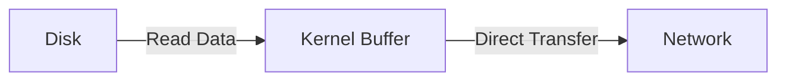
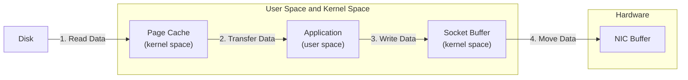

# 9. Page Cache

Imagine you have a special bookshelf where you keep your favorite books. When you read a book, instead of putting it back immediately, you leave it on this special shelf. The next time you want to read it, you can get it quickly without having to search through your entire library. This special shelf is like a page cache for a computer's disk.

A page cache is a part of the computer's memory that stores recently accessed disk data. When data is read from the disk, it is stored in the page cache. If the same data is needed again, the system can read it from the cache, which is much faster than reading it from the disk.

The term **"Cache"** is a general term for any storage that temporarily holds data to speed up access. It can refer to various types of caches, such as CPU cache, disk cache, or web cache.

The term **"Page Cache"** specifically refers to a part of the computer's memory that stores pages of data read from the disk to improve disk I/O performance. It is a type of cache used by the operating system to speed up disk access.

## Deep Dive and Important Points:

1. **How it Works:**

   - When data is read from the disk, it is placed in the page cache.
   - Future reads of the same data can be served from the cache instead of the disk.
   - This reduces the time and resources needed to access frequently used data.

2. **Benefits:**

   - **Faster Read Access:** Reading from memory is faster than reading from disk.
   - **Reduced Disk Wear:** Frequent reads from the page cache reduce the number of read operations on the physical disk, extending its lifespan.

3. **Increasing Disk Throughput:**

   **Batching**:

   - **Definition:** Batching is the process of grouping multiple operations together and executing them as a single batch.
   - **How it Helps:**
     - Reduces the overhead of processing individual operations.
     - Improves efficiency by minimizing the number of disk accesses.
     - For example, instead of writing data to disk every time a change is made, the system can collect multiple changes and write them all at once.

   **Zero-Copy Read**:

   - **Definition:** Zero-copy read is a method where data is transferred directly from the disk to the network or another process without copying it multiple times in memory.
   - **How it Helps:**
     - Reduces CPU usage by eliminating unnecessary data copying.
     - Increases throughput by allowing faster data transfer.
     - For example, when a file is read from disk and sent over the network, zero-copy read can send the data directly from the disk to the network buffer, bypassing intermediate copying steps.

### Detailed Example of Zero-Copy Read:

1. **Traditional Method:**

   - Data is read from disk into a buffer in the kernel space.
   - Data is then copied from the kernel buffer to a user-space buffer.
   - Finally, data is sent from the user-space buffer to the network.

2. **Zero-Copy Method:**
   - Data is read from disk directly into a network buffer in the kernel space.
   - Data is sent from the network buffer to the network without intermediate copying.

### Diagram of Zero-Copy Read:

## Differences in Page Cache Implementation Across OSs

| Aspect               | Linux                                        | Windows                               |
| -------------------- | -------------------------------------------- | ------------------------------------- |
| **Cache Type**       | Unified cache for file data and VM pages     | Separate caches for file I/O and VM   |
| **Writeback Policy** | Writeback with asynchronous `pdflush` daemon | Writeback with lazy writer process    |
| **Management Tools** | `vmstat`, `free`, `iostat`                   | Resource Monitor, Performance Monitor |

## Page Cach Flow

The diagram illustrates the flow of read messages from a disk through various buffers in the system until they reach the network interface. Here’s a step-by-step explanation of each part of the process:

1. **Reading from Disk to Page Cache**: Data is read from the disk and stored in the page cache. The page cache is part of the kernel space and serves as a temporary storage area for frequently accessed disk data to speed up subsequent reads.

2. **Page Cache to Application**: The application, running in user space, requests data. If the data is already in the page cache, it can be quickly accessed without reading the disk again. The data moves from the page cache in kernel space to the application in user space.

3. **Application to Socket Buffer**: The application processes the data and may need to send it over the network. It writes the data to the socket buffer. The socket buffer is part of the kernel space and temporarily holds data before it is transmitted over the network.

4. **Socket Buffer to NIC Buffer**: The data is moved from the socket buffer to the NIC (Network Interface Card) buffer. The NIC buffer is a hardware buffer that directly interfaces with the network hardware, preparing the data for transmission over the network.

## Summary:

Page cache helps improve disk throughput by storing frequently accessed data in memory for faster access. Techniques like batching and zero-copy read further enhance disk throughput by reducing overhead and minimizing unnecessary data copying. Batching groups multiple operations together for efficiency, while zero-copy read transfers data directly from disk to its destination, bypassing intermediate steps.
