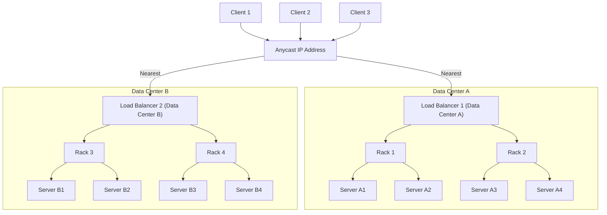

# 2. Host Discovery

## How to Design a DNS-like System

Imagine you have a phone book that helps you find the phone number of a person by their name. A DNS-like system works similarly by translating domain names (like www.example.com) into IP addresses (like 192.0.2.1).

A DNS-like system translates human-readable domain names into IP addresses that computers use to identify each other on the network.

### Steps to Design a DNS-like System:

1. **Domain Name Registration:** Users register domain names, which are stored in a central database.

2. **Hierarchical Structure:** Implement a hierarchical structure with root servers, top-level domain (TLD) servers (like .com, .net), and authoritative servers for specific domains.

3. **Name Resolution Process:**

   - When a client needs to resolve a domain name, it sends a query to a DNS resolver.
   - The resolver queries root servers, TLD servers, and authoritative servers to find the corresponding IP address.

4. **Caching:** To improve efficiency, DNS responses are cached at various levels to reduce the load on DNS servers and speed up the resolution process.

### Deep Dive and Important Points:

1. **DNS Resolution Workflow:**

   - **Client Query:** A client sends a DNS query to a resolver.
   - **Recursive Query:** The resolver queries root, TLD, and authoritative servers in a recursive manner.
   - **Response:** The resolver returns the resolved IP address to the client.

   ```mermaid
   sequenceDiagram
       participant Client
       participant Resolver as DNS Resolver
       participant Root as Root Server
       participant TLD as TLD Server
       participant Authoritative as Authoritative Server

       Client->>Resolver: 1. Send DNS Query (e.g., www.example.com)
       Resolver->>Root: 2. Query Root Server (for .com TLD)
       Root-->>Resolver: 3. Response to Resolver (TLD server for .com)
       Resolver->>TLD: 4. Query TLD Server (for example.com domain)
       TLD-->>Resolver: 5. Response to Resolver (Authoritative server for example.com)
       Resolver->>Authoritative: 6. Query Authoritative Server (for www.example.com)
       Authoritative-->>Resolver: 7. Response to Resolver (IP address of www.example.com)
       Resolver-->>Client: 8. Return IP Address (e.g., 192.0.2.1)
   ```

   1. **Client Query:** The client sends a DNS query to the DNS resolver.
   2. **Query Root Server:** The resolver queries the root server.
   3. **Response to Resolver:** The root server responds to the resolver.
   4. **Query TLD Server:** The resolver queries the TLD server.
   5. **Response to Resolver:** The TLD server responds to the resolver.
   6. **Query Authoritative Server:** The resolver queries the authoritative server.
   7. **Response to Resolver:** The authoritative server responds to the resolver.
   8. **Return IP Address:** The resolver returns the resolved IP address to the client.

2. **Hierarchical Structure:**

   - **Root Servers:** The top level in the DNS hierarchy, directing queries to TLD servers.
   - **TLD Servers:** Manage domains under specific top-level domains (e.g., .com, .org).
   - **Authoritative Servers:** Provide answers for specific domain names.

   ```mermaid
   graph TD
       A[Root Servers] --> B[TLD Servers]
       B --> C[.com TLD Server]
       B --> D[.org TLD Server]
       C --> E[Authoritative Servers for .com]
       D --> F[Authoritative Servers for .org]
       E --> G[example.com Authoritative Server]
       F --> I[example.org Authoritative Server]

   ```

3. **DNS Caching:**
   - DNS responses are cached to reduce query times and server load.
   - Cached data has a TTL (Time To Live) that determines how long it can be stored.

### Deep Dive and Important Points:

1. **Root Servers:** Direct queries to appropriate TLD servers.

2. **TLD Servers:** Direct queries to authoritative servers for specific domains.

3. **Authoritative Servers:** Provide the IP address for the requested domain.

4. **DNS Records:** Different types of DNS records (A, AAAA, CNAME, MX) provide various pieces of information about the domain.

## Anycast Network Routing Method

Imagine several copies of the same book are placed in libraries around the city. When you want the book, you are directed to the nearest library that has a copy. Anycast works similarly by directing your request to the closest server with the desired IP address.

Anycast is a network routing method where multiple servers share the same IP address, and the network directs a client's request to the nearest server.

### Steps in Anycast Operation:

1. **Multiple Servers, Single IP:** Multiple servers are configured to respond to the same IP address.

2. **Routing to Nearest Server:** The network uses routing protocols to direct the request to the nearest server.

3. **Load Balancing and Redundancy:** Anycast provides load balancing by distributing requests across multiple servers and ensures redundancy.

### Deep Dive and Important Points:

1. **Benefits:**

   - **Reduced Latency:** Clients are directed to the nearest server, minimizing response time.
   - **Load Balancing:** Distributes traffic across multiple servers, preventing overload.
   - **Redundancy:** Provides higher availability by having multiple servers ready to respond.

2. **Implementation:** Anycast is implemented using BGP (Border Gateway Protocol) to announce the same IP address from multiple locations.

3. **Use Cases:** Commonly used for DNS servers, CDNs (Content Delivery Networks), and DDoS mitigation.



### Summary:

- **DNS-like System Design:** Involves domain registration, hierarchical structure, recursive queries, and caching.
- **How DNS Works:** Translates domain names to IP addresses using a structured query process involving multiple DNS servers.
- **Anycast Network Routing:** Directs client requests to the nearest server with the same IP address, improving performance and reliability.
