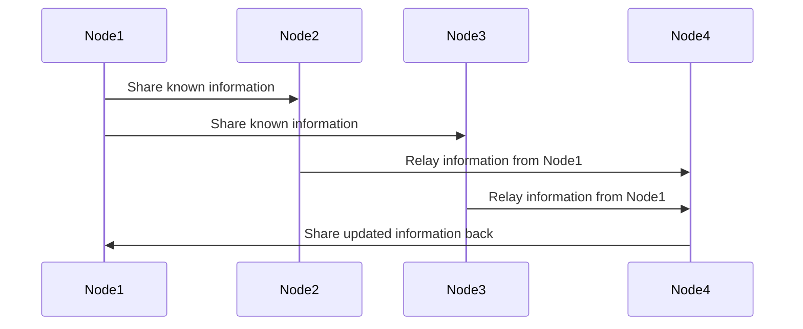

# 4. Peer Discovery

Imagine you are part of a large group of friends scattered around a city, and you need a way to find each other for a meetup. Peer discovery in computer networks works similarly, helping nodes (friends) in a distributed system locate and communicate with each other without relying on a central authority.

## Peer Discovery Options

### 1. Distributed Hash Table (DHT)

- **Definition:** A decentralized approach where peers collectively maintain a mapping of keys to network nodes.
- **Pros:** Scalable, fault-tolerant, no single point of failure.
- **Cons:** Can be complex to implement and manage.

### 2. Peer Exchange (PEX)

- **Definition:** Peers exchange information about other peers they know.
- **Pros:** Reduces the load on central servers, helps with NAT traversal.
- **Cons:** Can lead to inconsistent peer lists, slower peer discovery.

### 3. Gossip Protocol

- **Definition:** Peers periodically share information about themselves and other peers they know.
- **Pros:** Highly fault-tolerant, simple and robust, naturally scales with network size.
- **Cons:** Can introduce network overhead due to frequent communication.

### Centralized Server (as a Bootstrap Mechanism)

- **Definition:** A central server helps new or restarting nodes find initial peers but is not continuously relied upon for ongoing operations.
- **Pros:** Simplifies initial peer discovery, helps nodes join the network quickly.
- **Cons:** Single point of failure during the bootstrap phase.

## Membership and Failure Detection Problems

### Membership

- **Problem:** Keeping an updated list of active members (peers) in a distributed network.
- **Challenges:** Dynamic nature of peer networks with nodes joining and leaving frequently.

### Failure Detection

- **Problem:** Identifying and handling peers that have failed or become unreachable.
- **Challenges:** Differentiating between transient network issues and actual node failures, minimizing false positives and negatives.

## Seed Nodes

Seed nodes are well-known, stable nodes in a network that new or restarting nodes contact to discover other peers.

### Role

- **Bootstrap the Network:** Help new nodes find initial peers to connect with.
- **Stability:** Serve as reliable points of contact in the network.

### Example

In a peer-to-peer file-sharing network, a new node might contact a seed node to get a list of other peers from which to download files.

## How Gossip Protocol Works and Its Applications

### Gossip Protocol

A communication protocol in which nodes in a network periodically exchange information with a subset of other nodes, spreading knowledge in a manner similar to how gossip spreads in social networks.

#### How It Works

1. **Periodic Exchange:** Each node periodically selects a random subset of nodes to share its known information with.
2. **Information Dissemination:** Information spreads rapidly as nodes relay received information to their own subsets.
3. **Convergence:** Over time, all nodes in the network converge to a consistent state of knowledge.

#### Applications

- **Failure Detection:** Nodes share information about the health of other nodes, quickly identifying failures.
- **Membership Management:** Helps maintain an updated list of active nodes in dynamic networks.
- **Data Replication:** Ensures data consistency across distributed databases by spreading updates.

### Diagram of Gossip Protocol Workflow

### Summary

- **Peer Discovery Options:**
  - Distributed Hash Table (DHT)
  - Peer Exchange (PEX)
  - Gossip Protocol
  - Centralized Server (as a Bootstrap Mechanism)
- **Membership and Failure Detection Problems:**
  - Keeping an updated list of active peers
  - Identifying and handling failed peers
- **Seed Nodes:**
  - Stable nodes that help new nodes discover peers
- **Gossip Protocol:**
  - A robust, fault-tolerant method for disseminating information in a distributed network.

These concepts and mechanisms ensure effective peer discovery, maintain network stability, and provide resilience against node failures in distributed systems.
