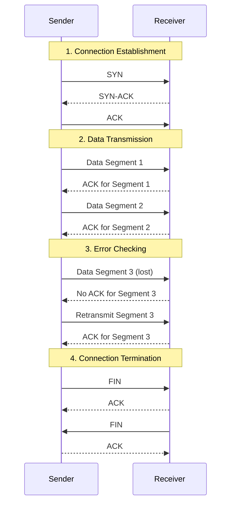
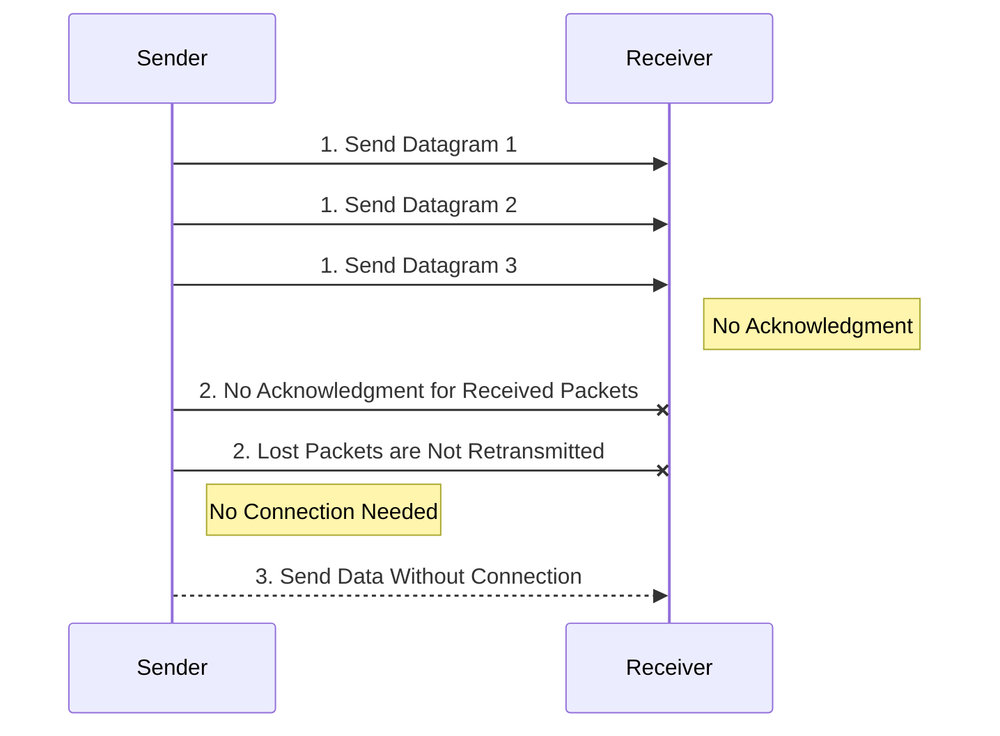
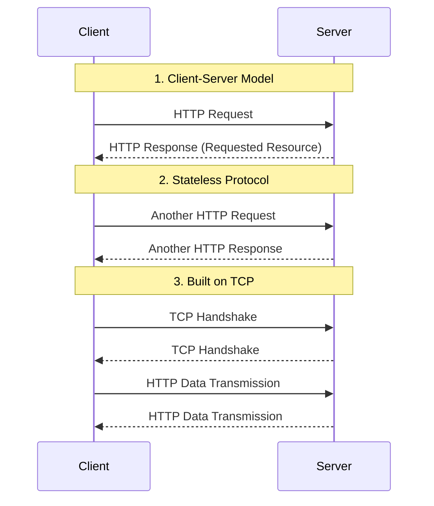

# 5. How to Choose a Network Protocol

Choosing the right network protocol for your application is crucial for ensuring efficient and reliable communication. Here’s a guide to help you understand when and how to choose between TCP, UDP, and HTTP network protocols.

### Transmission Control Protocol (TCP)

TCP (Transmission Control Protocol) is a connection-oriented protocol that ensures reliable and ordered delivery of data between applications. It establishes a connection before transmitting data and guarantees that packets are delivered in the correct order without errors.

#### When to Use TCP:

- **Reliability:** When data integrity and reliability are critical, such as in file transfers, emails, and web browsing.
- **Ordered Delivery:** When the order of data packets is important.
- **Error Correction:** When you need built-in error correction mechanisms.

#### How TCP Works:

1. **Connection Establishment:** TCP establishes a connection between the sender and receiver using a three-way handshake.
2. **Data Transmission:** Data is sent in segments, and TCP ensures that each segment is acknowledged by the receiver.
3. **Error Checking:** TCP checks for errors and ensures that data is retransmitted if necessary.
4. **Connection Termination:** The connection is closed after the data transmission is complete.

### User Datagram Protocol (UDP)

UDP (User Datagram Protocol) is a connectionless protocol that sends data packets (datagrams) without establishing a connection. It is faster than TCP but does not guarantee the delivery, order, or integrity of the data.

#### When to Use UDP:

- **Speed:** When low latency is more important than reliability, such as in real-time applications like video streaming, online gaming, and VoIP (Voice over IP).
- **Broadcast and Multicast:** When sending data to multiple recipients.
- **Simple Transactions:** When the overhead of establishing a connection is unnecessary, such as in DNS lookups.

#### How UDP Works:

1. **Data Transmission:** Data is sent in individual packets called datagrams.
2. **No Acknowledgment:** There is no acknowledgment for received packets, and lost packets are not retransmitted.
3. **No Connection:** Data can be sent without establishing a connection, reducing overhead and latency.

### Hypertext Transfer Protocol (HTTP)

HTTP (Hypertext Transfer Protocol) is an application-layer protocol used for transmitting hypermedia documents, such as HTML. It is built on top of TCP and is widely used for web communication.

#### When to Use HTTP:

- **Web Communication:** When interacting with web servers and browsers.
- **Request-Response Model:** When you need a simple request-response model for client-server communication.
- **Statelessness:** When the stateless nature of HTTP fits the application’s requirements, such as RESTful APIs.

#### How HTTP Works:

1. **Client-Server Model:** The client sends an HTTP request to the server, and the server responds with the requested resource.
2. **Stateless Protocol:** Each request-response pair is independent, and the server does not retain session information between requests.
3. **Built on TCP:** HTTP relies on TCP for reliable data transmission.

### Summary Table

| Protocol | Use Cases                            | Pros                                             | Cons                                                    |
| -------- | ------------------------------------ | ------------------------------------------------ | ------------------------------------------------------- |
| **TCP**  | File transfers, emails, web browsing | Reliable, ordered delivery, error correction     | Higher latency, connection overhead                     |
| **UDP**  | Video streaming, online gaming, VoIP | Low latency, broadcast/multicast support, simple | No reliability, no order guarantee, no error correction |
| **HTTP** | Web communication, RESTful APIs      | Simple request-response, built on TCP, stateless | Dependent on TCP, higher overhead for simple tasks      |

### Choosing the Right Protocol

- **Use TCP when:** You need reliable and ordered delivery of data, and can tolerate higher latency and connection overhead.
- **Use UDP when:** Speed and low latency are critical, and you can tolerate potential data loss and unordered delivery.
- **Use HTTP when:** You are dealing with web communication, need a stateless request-response model, and benefit from the simplicity of HTTP on top of TCP.

By understanding the strengths and weaknesses of TCP, UDP, and HTTP, you can make informed decisions about which protocol best suits your application's needs.
