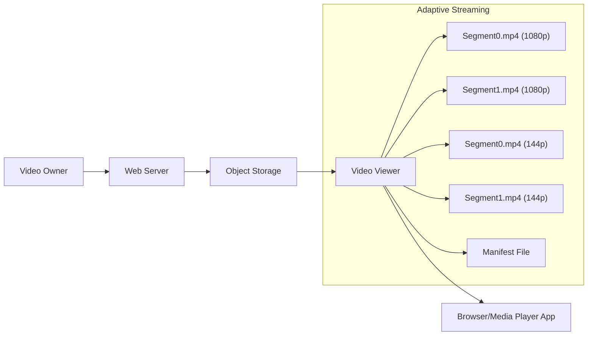
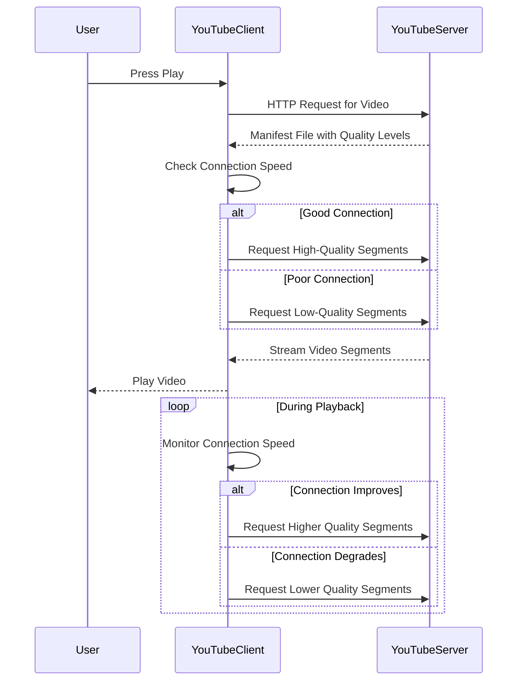

# 7. Video over HTTP

Video over HTTP refers to the delivery of video content to users via the HTTP protocol. This method leverages the existing web infrastructure to stream video content to web browsers, mobile applications, and other devices.

### Problem of Media Streaming

Streaming media over HTTP comes with several challenges that make it a complex task:

1. **Network Conditions:**

   - **Inconsistency:** Network conditions can vary widely, affecting video playback quality. Fluctuations in bandwidth, latency, and packet loss can cause buffering, interruptions, and degraded video quality.
   - **Adaptation:** Systems need to adapt to these varying conditions in real-time to provide a smooth viewing experience.

2. **Content Variability:**

   - **Multiple Versions:** Different users may require different versions of the same video (e.g., various resolutions, bitrates, and languages). This necessitates storing and managing multiple versions of each video.
   - **User Preferences:** Changes in user preferences (e.g., switching resolution or language) typically require downloading a different version of the video, leading to delays and increased storage requirements.

3. **Latency:**
   - **Buffering:** To mitigate interruptions, a certain amount of video data must be buffered, introducing initial playback delays.
   - **Segmenting:** Videos are often divided into segments to facilitate adaptive streaming, but each segment must be delivered in a timely manner.

### Adaptive Streaming

Adaptive streaming addresses many of the challenges associated with video over HTTP. It dynamically adjusts the quality of the video stream based on the current network conditions and device capabilities.

1. **How It Works:**

   - **Segmentation:** The video is divided into small segments (e.g., 2-10 seconds each). Each segment is encoded at multiple quality levels.
   - **Manifest File:** A manifest file (e.g., M3U8 for HLS) is used to describe the available segments and their respective quality levels.
   - **Dynamic Selection:** During playback, the media player dynamically selects the appropriate segment quality based on current network conditions, ensuring optimal performance.

2. **Benefits:**
   - **Smooth Playback:** By adjusting to network conditions, adaptive streaming minimizes buffering and interruptions, providing a seamless viewing experience.
   - **Efficient Bandwidth Use:** It optimizes the use of available bandwidth, ensuring the highest possible quality without overwhelming the network.
   - **User Experience:** Allows for continuous playback without the need to re-download the entire video when user preferences change (e.g., switching resolutions).

### Example of Adaptive Streaming

#### Scenario: Watching a Video on a Streaming Platform

1. **Initial Request:**

   - The user requests a video via their browser or app.
   - The server responds with a manifest file listing available video segments and quality levels.

2. **Segment Download:**

   - The media player begins downloading segments starting with a lower quality to ensure quick startup.
   - As the player assesses the network conditions, it may switch to higher quality segments if bandwidth allows.

3. **Dynamic Adjustment:**
   - Throughout playback, the media player continues to monitor network conditions.
   - If the network condition degrades, the player switches to lower quality segments to prevent buffering.
   - Conversely, if conditions improve, it switches to higher quality segments to enhance viewing experience.

### Conclusion

Video over HTTP, while challenging, is made more efficient and user-friendly through adaptive streaming techniques. By dynamically adjusting the video quality based on real-time network conditions, adaptive streaming ensures a smooth, uninterrupted viewing experience, optimizing both performance and user satisfaction.

### Example Diagram of Adaptive Streaming

## When You Press Play on YouTube:

1. **HTTP Request to YouTube Server:** The YouTube client (your app or browser) sends an HTTP request to the YouTube server to play a specific video.

2. **Server Response with Manifest File:** The YouTube server responds with a manifest file, often in the form of an MPEG-DASH (MPD) or HLS (M3U8) playlist. This manifest file contains information about the available quality levels (resolutions and bitrates) for the requested video, along with URLs for each segment of the video at those quality levels.

3. **Connection Check:** The YouTube client assesses your current internet connection speed and conditions. This step is essential to determine the most suitable video quality for streaming.

4. **Streaming the Appropriate Quality:**

   - Based on the connection check, the YouTube client selects the most appropriate quality level to start streaming. It begins downloading the video segments that match the chosen quality level.
   - The client continuously monitors the connection. If the internet speed improves or deteriorates, the client dynamically adjusts the quality level up or down to ensure smooth playback without buffering.

## Detailed Breakdown:

1. **HTTP Request:**

   - The user presses play on a YouTube video.
   - The YouTube client sends an HTTP GET request to the YouTube server for the video content.

2. **Manifest File:**

   - The server responds with a manifest file that lists all available quality levels (e.g., 144p, 240p, 360p, 480p, 720p, 1080p, 4K) and the URLs for the video segments at those levels.

3. **Connection Check:**

   - The YouTube client measures the current network speed and latency. This may involve initial buffering or a quick speed test.
   - The client determines the best quality that can be supported without causing buffering.

4. **Adaptive Streaming:**
   - The client starts downloading and playing the video segments at the selected quality.
   - As the video plays, the client continuously checks the network conditions.
   - If the network speed decreases, the client switches to a lower quality to prevent buffering.
   - If the network speed increases, the client switches back to a higher quality to improve the viewing experience.

## Example Sequence Diagram:

