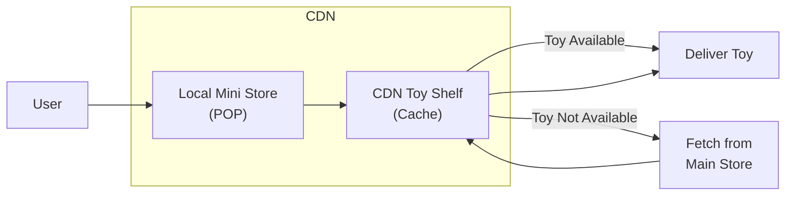

# 8. CDN

Imagine you have a favorite toy store, but it's really far away. Every time you want a toy, you have to travel a long distance, which takes a lot of time. What if there were mini toy stores closer to your house that had all the toys you wanted? You could get your toys much faster! That's what a CDN (Content Delivery Network) does for websites.

### How to Use a CDN

1. **Choose a CDN Provider:** Think of this like picking your favorite toy brand, such as Lego or Hot Wheels. You choose a CDN provider like Cloudflare, Akamai, or Amazon CloudFront.

2. **Set Up Your Website:** Just like setting up a toy display at your favorite store, you set up your website to work with the CDN. This involves changing some settings so the CDN can start helping.

3. **Upload Your Content:** You give the CDN copies of all your website's pictures, videos, and other files, just like stocking the toy shelves with toys.

4. **Set Cache Rules:** You tell the CDN how long to keep each toy on the shelves before refreshing them, similar to restocking the toy store.

### How CDN Works

1. **Content Distribution:** The CDN stores copies of your website's files (like toys) in many different mini stores (servers) around the world.

2. **User Request:** When someone wants to visit your website, the request goes to the nearest mini store instead of the faraway main store.

3. **Content Delivery:** The mini store quickly gives the visitor the files they need, just like getting toys from a nearby store.

4. **Cache Miss:** If the toy isn't in the mini store, the store gets it from the main store, saves it, and then gives it to the visitor.

### Point of Presence (POP)

- **Definition:** A Point of Presence (POP) is like a mini toy store where the CDN keeps copies of your website's files.
- **Function:** These mini stores are placed all around the world to make sure everyone can get their toys (files) quickly.

### Benefits of CDN

1. **Improved Performance:**

   - **Faster Load Times:** By getting files from the nearest mini store, websites load much faster.
   - **Reduced Server Load:** The main store doesn't get too crowded because the mini stores are helping out.

2. **Enhanced Reliability:**

   - **Redundancy:** If one mini store runs out of a toy, another one can still provide it.
   - **Scalability:** Mini stores can handle a lot of visitors, even when there are big crowds.

3. **Better Security:**

   - **DDoS Protection:** Mini stores can help protect the main store from too many visitors at once, like a crowd control.
   - **Secure Content Delivery:** Mini stores can deliver files safely, making sure they don't get damaged or lost.

4. **Global Reach:**
   - **Localized Content:** People all over the world can get their toys (files) quickly from a nearby mini store.

### Example Diagram of CDN Workflow

## Summary

A CDN is like a network of mini toy stores that keeps copies of your website's files closer to where people are. By using a CDN, your website can load faster, be more reliable, and stay safe. Points of Presence (POPs) are the mini stores that deliver these files quickly to users around the world.

Next topic:

- Short polling.
- Long polling.
- Websocket.
- Server-sent events.
