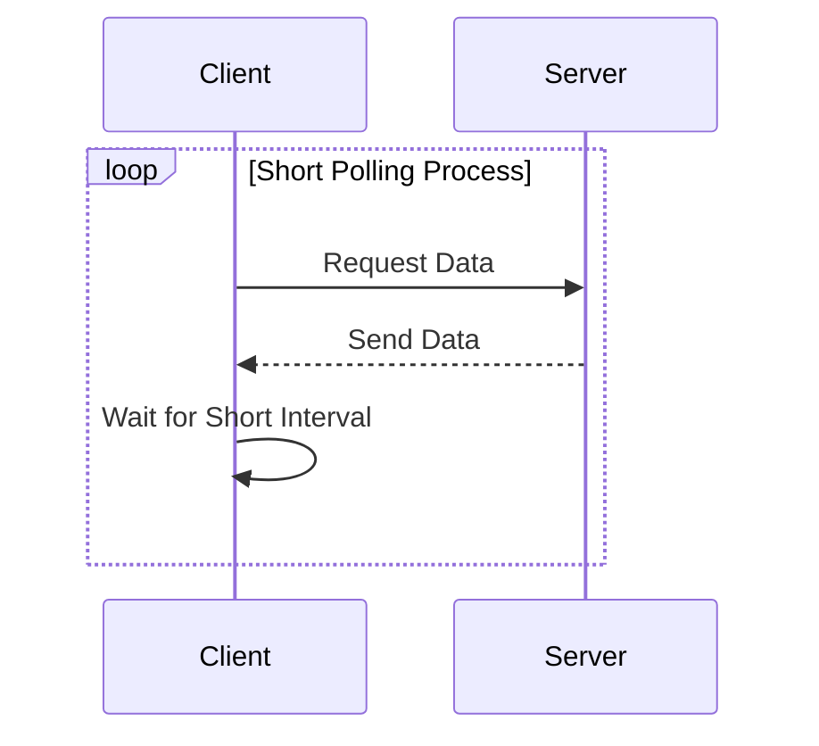
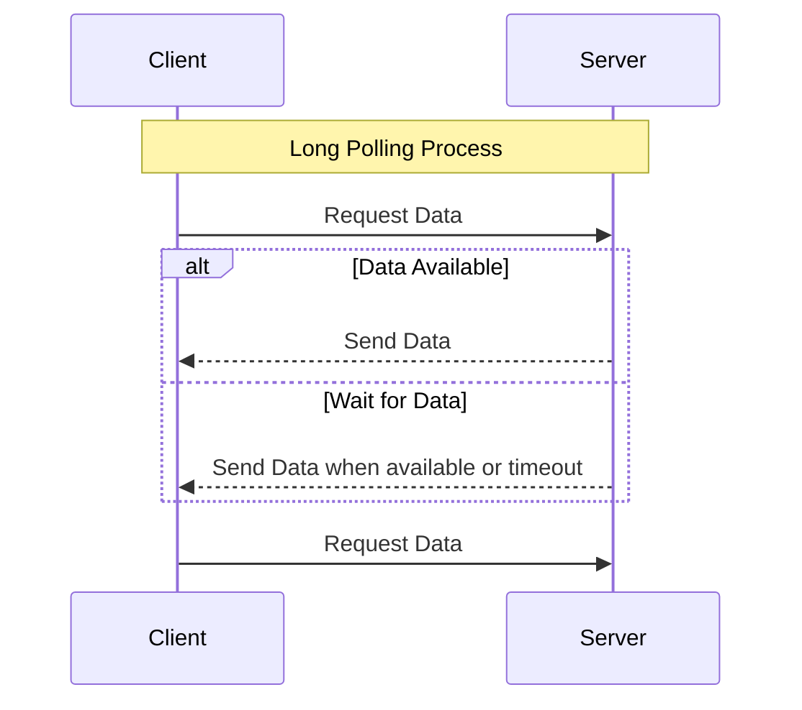
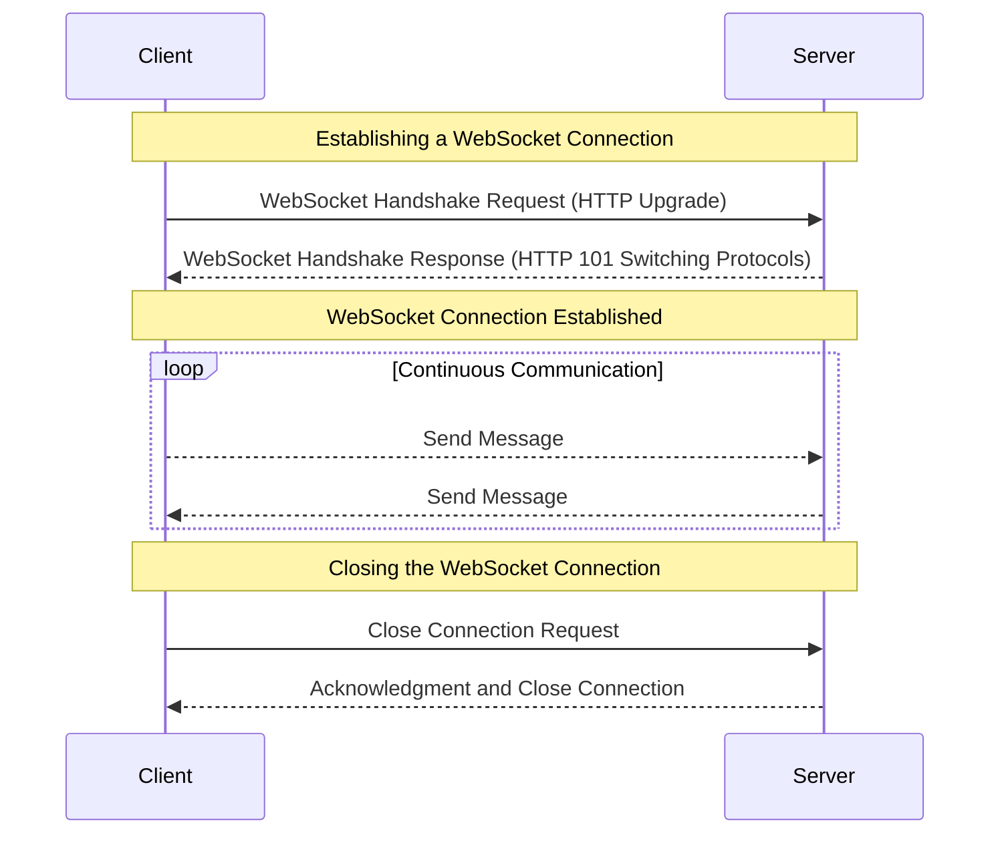
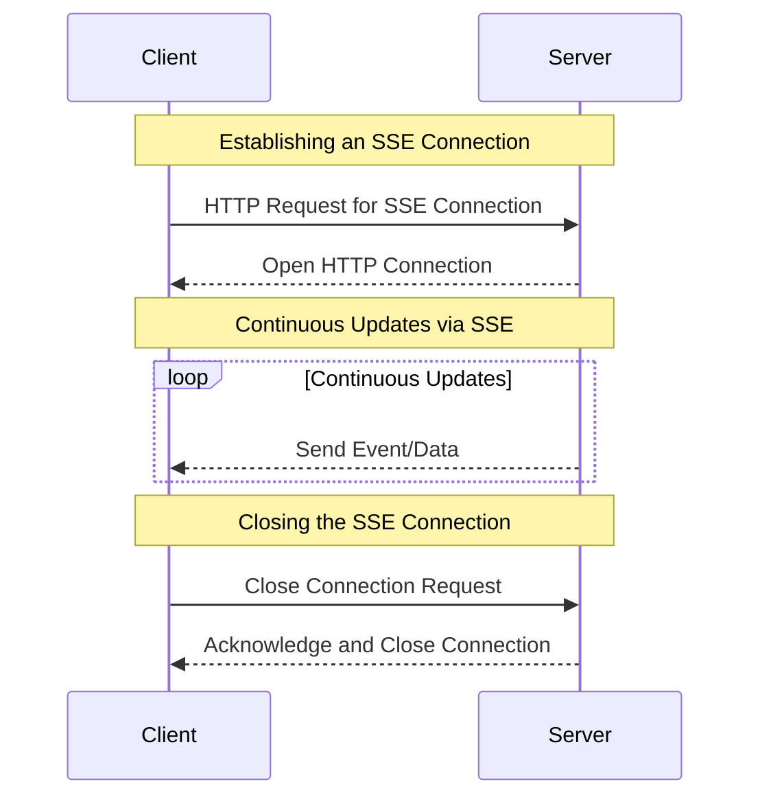

# 9. Push and Pull Technologies

Push and pull technologies are methods used by web applications to communicate with servers to receive data updates. In a pull model, the client requests data from the server at regular intervals. In a push model, the server sends updates to the client as soon as they are available.

### Short Polling

Short polling is a pull technology where the client repeatedly requests data from the server at regular, short intervals.

1. **Client Request:** The client sends a request to the server.
2. **Server Response:** The server processes the request and sends back the current data.
3. **Repeat:** The client waits for a short period (e.g., a few seconds) and then sends another request.

#### Advantages:

- **Simplicity:** Easy to implement.
- **Compatibility:** Works with all browsers and servers.

#### Disadvantages:

- **Inefficiency:** Generates a lot of unnecessary traffic and load on the server.
- **Latency:** The client may receive updates with a delay, depending on the polling interval.

### Long Polling

Long polling is a technique where the client requests data from the server, but the server holds the request open until new data is available.

1. **Client Request:** The client sends a request to the server.
2. **Server Waits:** The server holds the request open until new data is available.
3. **Server Response:** When new data is available, the server sends a response.
4. **Repeat:** The client immediately sends another request after receiving the response.

#### Advantages:

- **Reduced Latency:** Provides updates as soon as they are available.
- **Efficient Use of Bandwidth:** Fewer requests compared to short polling.

#### Disadvantages:

- **Complexity:** More complex to implement than short polling.
- **Resource Intensive:** Holding connections open can consume server resources.

### WebSocket

WebSocket is a push technology that provides full-duplex communication channels over a single, long-lived connection.

1. **Connection Establishment:** The client and server establish a WebSocket connection through a handshake using HTTP.
2. **Full-Duplex Communication:** Both the client and server can send and receive messages independently over the same connection.

#### Advantages:

- **Real-Time Communication:** Enables real-time data transfer with low latency.
- **Efficiency:** Reduces overhead compared to HTTP polling, as a single connection is used for continuous communication.

#### Disadvantages:

- **Complexity:** More complex to implement than traditional HTTP polling.
- **Compatibility:** Requires WebSocket support in both client and server.

### Server-Sent Events (SSE)

Server-Sent Events (SSE) is a push technology where the server can send automatic updates to the client over a single HTTP connection.

1. **Client Request:** The client sends a request to the server to initiate an SSE connection.
2. **Persistent Connection:** The server keeps the connection open and sends updates as they become available.
3. **Automatic Updates:** The client receives updates automatically without needing to send further requests.

#### Advantages:

- **Simplicity:** Easier to implement compared to WebSocket.
- **Efficient:** Uses a single connection for continuous updates.

#### Disadvantages:

- **One-Way Communication:** Only the server can send updates to the client.
- **Limited Browser Support:** Not all browsers support SSE.

## Summary

Push and pull technologies are essential for modern web applications to communicate with servers efficiently. Short polling and long polling are pull techniques, with long polling being more efficient. WebSocket and Server-Sent Events are push techniques, with WebSocket enabling full-duplex communication and SSE allowing for easy server-to-client updates. Each method has its advantages and disadvantages, and the choice depends on the specific requirements of the application.
