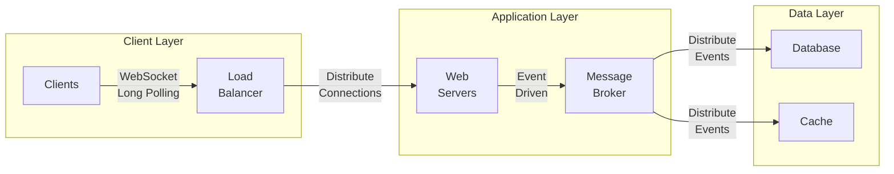

# 11. Large-Scale Push Architectures

### C10K Problem

- **Definition:** The C10K problem refers to the challenge of handling 10,000 concurrent client connections.
- **Origin:** The term was coined in the late 1990s when managing such a large number of simultaneous connections was a significant challenge due to the limitations of server hardware and network stacks.
- **Solutions:** Advances in operating systems, network protocols, and server software (such as the use of non-blocking I/O and event-driven architectures) have addressed many aspects of the C10K problem.

### C10M Problem

- **Definition:** The C10M problem extends the challenge to handling 10 million concurrent client connections.
- **Scale:** This is a modern challenge faced by large-scale web services and applications, particularly those providing real-time data to a massive number of clients.
- **Solutions:** Solutions involve highly optimized servers, efficient networking protocols, and advanced load balancing techniques.

## Examples of Large-Scale Push Architectures

### 1. Social Media Platforms

- **Example:** Facebook, Twitter
- **Architecture:** Use a combination of WebSockets, server-sent events (SSE), and long polling to push real-time updates to millions of users.
- **Challenges Addressed:** Handling millions of concurrent connections, ensuring low latency, and maintaining data consistency.

### 2. Financial Trading Platforms

- **Example:** Bloomberg Terminal, Robinhood
- **Architecture:** Use WebSockets to provide real-time updates on stock prices and trades.
- **Challenges Addressed:** Low latency, high reliability, and security for financial data.

### 3. Online Gaming

- **Example:** Fortnite, League of Legends
- **Architecture:** Use UDP for fast, real-time game updates, supplemented by TCP/WebSockets for critical data and chat functionalities.
- **Challenges Addressed:** Low latency, real-time synchronization, and handling millions of simultaneous players.

### 4. IoT Systems

- **Example:** Smart Home Systems, Industrial IoT
- **Architecture:** Use MQTT, a lightweight messaging protocol optimized for devices with limited resources.
- **Challenges Addressed:** Efficiently handling a large number of devices, ensuring low power consumption, and maintaining real-time updates.

## Problems of Handling Long-Lived Connections at Large Scale

### 1. Resource Management

- **CPU and Memory Usage:** Maintaining a large number of connections requires significant CPU and memory resources. Each connection consumes file descriptors and other system resources.
- **Solution:** Use non-blocking I/O and efficient connection handling techniques to minimize resource usage.

### 2. Scalability

- **Vertical Scaling Limits:** There is a limit to how much a single server can be scaled up (more CPU, memory).
- **Horizontal Scaling:** Distribute connections across multiple servers. Use load balancers and clustering techniques to manage the connections effectively.

### 3. Load Balancing

- **Balancing Connections:** Efficiently distributing the load across multiple servers is crucial to prevent any single server from becoming a bottleneck.
- **Solution:** Use advanced load balancing algorithms that consider the current load and capacity of each server.

### 4. Network Bandwidth

- **High Traffic:** Large-scale push architectures generate significant network traffic, which can strain network bandwidth.
- **Solution:** Optimize data transmission, use compression, and deploy content delivery networks (CDNs) to distribute the load.

### 5. Fault Tolerance and Reliability

- **Handling Failures:** Ensuring the system remains operational in the event of server failures or network issues is critical.
- **Solution:** Implement redundancy, failover mechanisms, and real-time monitoring to detect and respond to issues quickly.

### 6. Security

- **Securing Connections:** Long-lived connections must be secured to protect against attacks such as DDoS and data breaches.
- **Solution:** Use encryption (TLS), implement rate limiting, and monitor for suspicious activity.

## Example Diagram of Large-Scale Push Architecture

## Summary

Handling large-scale push architectures, such as those needed for social media platforms, financial trading systems, online gaming, and IoT, involves addressing challenges related to resource management, scalability, load balancing, network bandwidth, fault tolerance, and security. Solutions to these challenges include using non-blocking I/O, horizontal scaling, advanced load balancing, optimizing data transmission, implementing redundancy, and ensuring strong security measures.
