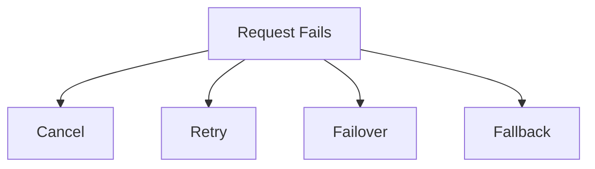

# 3. What to do with Failed Requests

When you try to do something and it doesn't work, you need a plan to handle it. In computers, there are different ways to manage things that fail. Let's look at some of them.

1. **Cancel:**

   - **What it means:** Stop and report the failure.
   - **When to use it:** When you can't continue safely.
   - **Example:** Canceling a download that fails due to no internet.

2. **Retry:**

   - **What it means:** Try again.
   - **When to use it:** When the problem might fix itself (like a small internet glitch).
   - **Example:** Retrying a message that didn't send because of a weak signal.

3. **Failover:**

   - **What it means:** Switch to a backup system.
   - **Why it's important:** It keeps things working by using a spare.
   - **Example:** Using a backup generator when the power goes out.

4. **Fallback:**
   - **What it means:** Switch to a different way or system.
   - **Why it's important:** It keeps things going even if the main way fails.
   - **Example:** Using a different route when your usual path is blocked.

## Summary

When things don't work, you can cancel, retry, failover, or fallback. Canceling stops everything. Retrying tries again. Failover uses a backup. Fallback uses a different way. These strategies help make sure things keep working even when problems happen.
