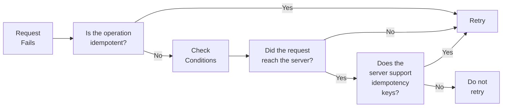

# 4. When to Retry

## Idempotency

Idempotency is a big word that means doing something multiple times gives the same result as doing it once.

- **Example:** Imagine you have a light switch. Flipping the switch once turns the light on. Flipping it again doesn't make it brighter; the light stays on. This is like idempotency.

### Idempotent Operations:

- **Idempotent:** If you do the same action many times, you get the same result.
  - **Example:** Setting `x = 5`. No matter how many times you do this, `x` will always be 5.
- **Not Idempotent:** If you do the same action many times, you get different results.
  - **Example:** Incrementing `x++`. Each time you do this, `x` increases by 1.

### Idempotent APIs:

- **Read API:** These are usually idempotent. If you ask for the same data many times, you get the same result.
  - **Example:** Asking what time it is now.
- **Write API:** These are usually not idempotent. If you create a new record many times, you get multiple records.
  - **Example:** Creating a new user account every time you send a request.

## When to Retry

Retrying is trying something again when it fails the first time. Whether it's safe to retry depends on whether the operation is idempotent.

If you can do something many times and it gives the same result, it's usually safe to retry.

### Safe to Retry:

- **Idempotent APIs:** These are safe to retry.

  - **Example:** If you ask for the same data again, you just get the same data.

- **Non-Idempotent APIs:** These are only safe to retry if:
  - The original request never reached the server.
  - The server supports idempotency keys (special tokens to ensure the operation happens only once).

### HTTP Status Codes and Retrying:

1. **Network Connection Not Established (N/A):** Yes, retry.

   - The request never reached the server.

2. **Bad Request (400):** No, don't retry.

   - There is a problem with the request.

3. **Access Denied (403):** No, don't retry.

   - Security credentials are not valid.

4. **Not Found (404):** No, don't retry.

   - The resource doesn't exist.

5. **Too Many Requests (429):** Yes, retry after a delay.

   - The request was rejected because of too many requests.

6. **Internal Server Error (500):** Yes, if idempotent.

   - The server encountered an error.

7. **Service Unavailable (503):** Yes, retry.

   - The service is temporarily unavailable.

8. **Request Timeout (504):** Yes, if idempotent.
   - The request hit the server but didn't complete in time.

## Quiz: Which AWS API Failures are Safe to Retry?

- **Network Connection Not Established (N/A):** Yes
- **Bad Request (400):** No
- **Access Denied (403):** No
- **Not Found (404):** No
- **Too Many Requests (429):** Yes, after a delay
- **Internal Server Error (500):** Yes, if idempotent
- **Service Unavailable (503):** Yes
- **Request Timeout (504):** Yes, if idempotent

## Summary

Retrying an operation is like trying again if something goes wrong. If an operation is idempotent, it's usually safe to retry. For non-idempotent operations, retry only if the original request never hit the server or if the server supports idempotency keys. Understanding when to retry based on the type of API and the response status code helps keep systems reliable and efficient.
