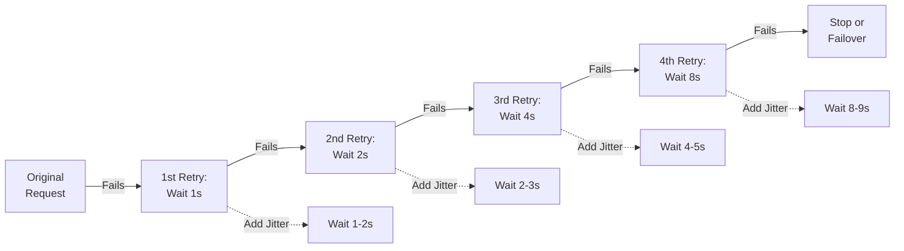

# 5. How to Retry

## Exponential Backoff and Jitter

When you try to do something and it doesn't work, you might want to try again. But if you keep trying immediately, it might just keep failing. To avoid this, you can wait a bit longer each time before trying again. This is called exponential backoff. Adding a bit of randomness to the waiting time is called jitter.

### Exponential Backoff:

Exponential backoff means waiting longer and longer before each retry.

- **Example:** Imagine you're trying to reach a friend on the phone. The first time, you wait 1 second before trying again. If it fails, you wait 2 seconds, then 4 seconds, then 8 seconds, and so on. The waiting time doubles each time.

- **Definition:** Increasing the wait time between retries exponentially.

- **Why it’s useful:** Helps prevent overwhelming the system by spreading out the retries.

- **Example in Software:** If a request to a server fails, the client waits 1 second, then 2 seconds, then 4 seconds, and so on, before retrying.

### Jitter:

Jitter means adding some randomness to the waiting time to avoid everyone trying again at the exact same moment.

- **Example:** If you and your friends are all trying to call the same person, you each wait a random amount of time before trying again. This way, you're not all calling at the exact same time.

- **Definition:** Adding randomness to the wait time.

- **Why it’s useful:** Prevents multiple clients from retrying at the same time, which can cause traffic spikes.

- **Example in Software:** If multiple clients are retrying a failed request, each waits a slightly different random amount of time before retrying.

## Example Code:

Here’s a simple way to implement exponential backoff with jitter in code:

```rust
use tokio::time::{sleep, Duration};
use rand::Rng;

async fn retry_with_backoff<F, Fut, T, E>(operation: F, max_retries: u32)
    -> Result<T, E>
where
    F: Fn() -> Fut,
    Fut: std::future::Future<Output = Result<T, E>>,
{
    // Start with 0 retries
    let mut retries = 0;
    // Initialize random number generator
    let mut rng = rand::thread_rng();

    loop {
        // Execute the operation and match on the result
        match operation().await {
            Ok(result) => return Ok(result), // If successful, return the result
            Err(err) if retries < max_retries => {
                retries += 1; // Increment retry count
                // Calculate exponential backoff with jitter
                let backoff = 2u64.pow(retries) + rng.gen_range(0..1000);
                sleep(Duration::from_millis(backoff)).await; // Wait before retrying
            }
            Err(err) => return Err(err), // If max retries exceeded, return the error
        }
    }
}

#[tokio::main]
async fn main() {
    // Example operation that always fails for demonstration
    let result = retry_with_backoff(
        || async {
            // Replace this with your actual operation
            Err::<(), _>("SomeExceptionType")
        },
        5,
    )
    .await;

    match result {
        Ok(_) => println!("Operation succeeded."),
        Err(_) => println!("Operation failed after retries."),
    }
}

```

This code retries a failed request 5 times, with an exponentially increasing wait time and up to 1 second of random jitter.



## Summary

When retrying an operation, exponential backoff helps by waiting longer between each retry, and jitter adds randomness to avoid traffic spikes. Together, they make retries more effective and prevent systems from being overwhelmed by repeated requests.
