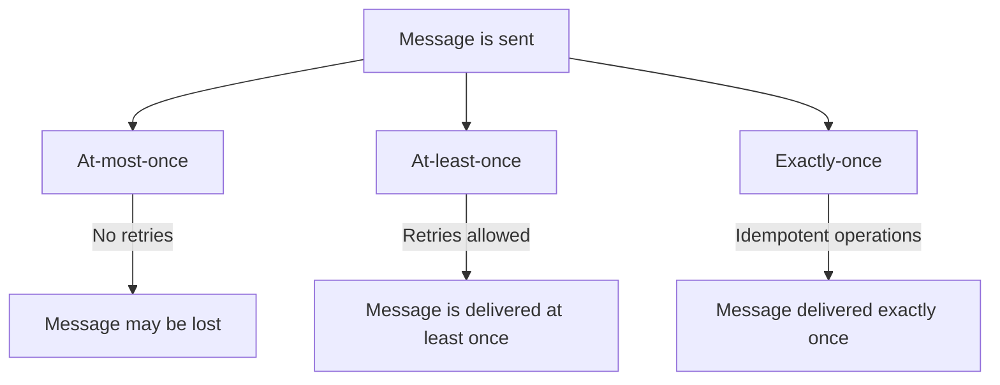

# 6. Message Delivery Guarantees

When sending messages between systems, it’s important to know how many times a message might be delivered. There are three main guarantees: at-most-once, at-least-once, and exactly-once. Let’s break them down in a way that’s easy to understand.

## 1. At-most-once Guarantee

- **Definition:** A message is delivered at most once. No retries are made if a message fails.
- **Characteristics:**
  - Simple and fast.
  - No duplicates, but messages might be lost.
- **Example:** Sending an HTTP GET request. If the request fails, the system does not retry.

## 2. At-least-once Guarantee

- **Definition:** A message is delivered at least once. It might be delivered more than once.
- **Characteristics:**
  - Ensures no message is lost.
  - May result in duplicates.
- **Example:** Using a message queue with retries. If a message fails, the system retries until it succeeds.

## 3. Exactly-once Guarantee

- **Definition:** A message is delivered exactly once, with no duplicates and no messages lost.
- **Characteristics:**
  - Requires careful design.
  - Often uses idempotency and transaction logs.
- **Example:** Using a system with idempotent operations and transactions. If you create a record, it is created exactly once.

## Summary

Understanding message delivery guarantees helps design systems that are reliable and predictable. At-most-once is simple but might lose messages. At-least-once ensures no messages are lost but might duplicate them. Exactly-once is the gold standard, ensuring each message is delivered only once.

| Guarantee     | Description                                   | Example                                      |
| ------------- | --------------------------------------------- | -------------------------------------------- |
| At-most-once  | Delivered at most once. No retries.           | HTTP GET request.                            |
| At-least-once | Delivered at least once. Might be duplicated. | Message queue with retries.                  |
| Exactly-once  | Delivered exactly once. No duplicates.        | Idempotent operations with transaction logs. |

