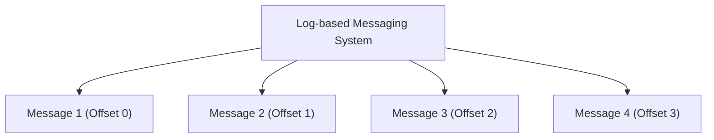
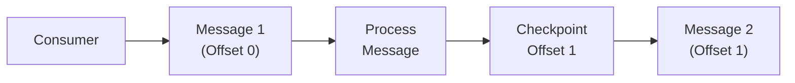

# 7. Consumer Offsets

## Log-based Messaging Systems

Imagine you have a big notebook where you write down every message you receive. Each message gets a number, like pages in a book. This notebook is called a "log."

These systems use a log to keep track of messages. Every message gets a number (an offset), so you always know where to find each message.

- Messages are stored in a log file on disk.
- Each message has a unique offset, like a page number in a book.
- The log allows you to go back and read any message, not just the latest ones.

**Examples:**

- **Kafka**: Uses a log to store messages, and each consumer keeps track of their own offset.
- **Kinesis**: Similar to Kafka, where messages are stored in a log and consumers manage offsets.

## Checkpointing

Checkpointing is like marking your place in a book so you can easily find it later. In messaging systems, checkpointing means saving the offset of the last message you processed, so if you stop reading and come back later, you know where to start.

1.  **Checkpointing:**

    - The process of saving the current offset (position) of a consumer.
    - Ensures that if a consumer restarts, it knows where to continue from.
    - Can be done before or after processing a message.

2.  **Options for Handling Messages:**

    - **Option 1: Delete Message When Processed**
      - The message is removed from the queue once it's processed.
      - Example systems: ActiveMQ, RabbitMQ, SQS.
    - **Option 2: Increment Message Position**
      - The consumer keeps track of the offset and increments it after processing.
      - Example systems: Kafka, Kinesis.

3.  **Types of Checkpointing:**

    - **At-most-once:** Checkpoint before processing the message.
    - **At-least-once:** Checkpoint after processing the message.
    - **Exactly-once:** Requires idempotent processing to ensure no duplicates.

### Example:

- **Kafka Checkpointing:**
  - Uses ZooKeeper or a similar service to store offsets.
  - Ensures that consumers can restart from the correct position.

## Summary

Consumer offsets help keep track of the position in the message log. Log-based messaging systems like Kafka and Kinesis store messages in a log with unique offsets. Checkpointing ensures that consumers can restart from the correct position, maintaining reliable message processing. There are different strategies for handling messages and ensuring message delivery guarantees.
