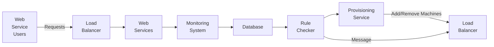

# 3. Autoscaling System Design

Imagine you have a magical toy factory that not only grows and shrinks based on demand but also has a smart system to manage this process. This smart system ensures that the factory always has enough workers and resources to make toys, without wasting any. Designing an autoscaling system for computers is like setting up this smart management system for the toy factory.

Autoscaling system design is about creating a plan for how a computer system can automatically adjust its resources (like servers) based on the current demand. This involves setting up rules, monitoring performance, and ensuring everything works smoothly.

## How to Design an Autoscaling System:

1. **Monitoring System:**

   - **What it is:** A system that constantly checks the performance of your servers, like checking CPU utilization, memory usage, and network traffic.
   - **Example:** Think of it as having sensors in the factory that tell you how busy each worker is.

2. **Autoscaling Rules:**

   - **What it is:** Specific conditions that determine when to add or remove resources.
   - **Example:** If the factory sensors show that workers are very busy (over 80% utilization), add more workers.

3. **Rule Checker:**

   - **What it is:** A component that reads the autoscaling rules and checks if the current performance meets the conditions to scale up or down.
   - **Example:** It's like a manager who looks at the sensor data and decides if more workers are needed based on the rules.

4. **Provisioning Service:**

   - **What it is:** A service that actually adds or removes resources based on the decisions made by the rule checker.
   - **Example:** The manager calls more workers to the factory or sends some home if there are too many.

5. **Load Balancer:**

   - **What it is:** A tool that distributes incoming requests evenly across all available resources.
   - **Example:** It's like directing incoming toy orders to the workers in the factory so that no one gets overwhelmed.

## Deep Dive and Important Points:

1. **Monitoring System:**

   - **Definition:** Collects real-time data on resource usage.
   - **Importance:** Accurate monitoring is crucial for making informed scaling decisions.
   - **Example Tools:** Prometheus, CloudWatch.

2. **Autoscaling Rules:**

   - **Definition:** Defines the conditions for scaling actions.
   - **Types:** Metric-based, schedule-based, predictive.
   - **Example:** Add a server if CPU usage is above 80% for 5 minutes.

3. **Rule Checker:**

   - **Definition:** Evaluates the rules against the collected metrics.
   - **Function:** Decides if scaling actions are needed.
   - **Implementation:** Can use leader election for distributed systems or rely on distributed locks.

4. **Provisioning Service:**

   - **Definition:** Manages the lifecycle of resources (adding/removing servers).
   - **Tasks:** Provision new servers, decommission unused ones.
   - **Example Tools:** AWS Auto Scaling, Kubernetes Horizontal Pod Autoscaler.

5. **Load Balancer:**

   - **Definition:** Distributes workload evenly.
   - **Function:** Prevents any single resource from becoming a bottleneck.
   - **Example Tools:** NGINX, HAProxy.

## Summary

Designing an autoscaling system is like setting up a smart management system for a magical factory that grows and shrinks based on demand. It involves monitoring performance, setting up rules for when to add or remove resources, and ensuring that incoming requests are evenly distributed. Key components include the monitoring system, autoscaling rules, rule checker, provisioning service, and load balancer. These components work together to ensure the system can handle varying loads efficiently and reliably.

