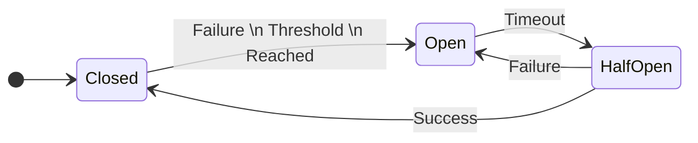

# 2. Circuit breaker

Imagine you have a toy train set, and there's a button that stops the train if it goes off the track. This button is like a circuit breaker for software systems. It stops sending requests to a server that's having problems to prevent further issues.

- It is a safety mechanism that stops making requests if a service is not responding properly.
- It's like a fuse in your house that stops electricity flow if something goes wrong.

## Circuit Breaker Finite-State Machine:

Think of it as a traffic light with three states: green, yellow, and red.

1. **Closed (Green Light):**

   - Requests are flowing normally.
   - If too many requests fail, it changes to the next state.

2. **Open (Red Light):**

   - Requests are blocked to prevent further failures.
   - After a certain time, it moves to the next state to check if the service is back.

3. **Half-Open (Yellow Light):**
   - Some requests are allowed to check if the service has recovered.
   - If successful, it goes back to the closed state. If not, it returns to the open state.

## Important Considerations about the Circuit Breaker Pattern:

1. **Thresholds:** Define how many failures trigger the circuit breaker to open.

2. **Timeouts:** Set how long to wait before moving from open to half-open state.

3. **Fallback Mechanisms:** Provide an alternative response when the circuit breaker is open.

4. **Monitoring and Logging:** Keep track of failures and successes to adjust the circuit breaker behavior.

## Key Terms:

- **Finite-State Machine:** A model with a limited number of states and transitions between them.

- **Threshold:** The point at which the circuit breaker opens due to failures.

- **Timeout:** The time period the circuit breaker stays open before checking again.

- **Fallback:** An alternative action when the primary request fails.

## Summary

A circuit breaker in software acts like a safety switch that stops requests to a failing service to prevent more problems. It works through a finite-state machine with closed, open, and half-open states. Important considerations include setting thresholds, timeouts, and fallback mechanisms to ensure smooth operation and recovery.
