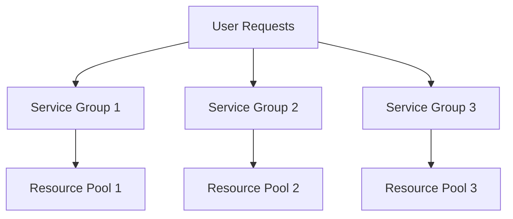

# 4. Bulkhead

Imagine a ship with multiple compartments. If one compartment gets damaged and fills with water, the other compartments remain intact, preventing the ship from sinking. The bulkhead pattern in software works the same way by isolating different parts of the system to prevent a failure in one part from affecting the rest.

## Bulkhead Pattern:

- Isolates different components of a system into separate sections.
- Prevents failures in one section from affecting others.
- It's like having watertight compartments in a ship.

## Why Use the Bulkhead Pattern?

- **Fault Isolation:** Keeps failures contained to prevent widespread issues.
- **Increased Resilience:** Improves the system's ability to handle failures.
- **Enhanced Reliability:** Ensures that a failure in one component doesn't bring down the entire system.

## Implementing the Bulkhead Pattern in Distributed Systems:

1. **Service Isolation:**

   - Divide services into isolated groups.
   - Each group operates independently, so a failure in one doesn't impact the others.

   ```mermaid
   graph TD
     A[Service Group 1] -- Isolation --> B[Service Group 2]
     A -- Isolation --> C[Service Group 3]
   ```

2. **Resource Allocation:**

   - Allocate separate resources (like threads, memory, connections) for different parts of the system.
   - Ensures that resource exhaustion in one part doesn't affect others.

   ```rust
   use std::thread;

   let group1_handle = thread::spawn(|| {
       // Group 1 work
   });

   let group2_handle = thread::spawn(|| {
       // Group 2 work
   });

   group1_handle.join().unwrap();
   group2_handle.join().unwrap();
   ```

3. **Circuit Breakers:**

   - Use circuit breakers to detect and isolate failures in different parts of the system.
   - Each part has its own circuit breaker to prevent cascading failures.

   ```rust
   use circuit_breaker::{CircuitBreaker, Config};

   let config = Config::default()
       .failure_threshold(5)
       .reset_timeout(std::time::Duration::new(10, 0));

   let group1_circuit_breaker = CircuitBreaker::new("group1", config.clone());
   let group2_circuit_breaker = CircuitBreaker::new("group2", config.clone());
   ```

4. **Timeouts and Retries:**

   - Set timeouts for requests and retries to prevent prolonged failures from spreading.
   - Each section can have its own timeout and retry policy.

   ```rust
   use std::time::Duration;
   use reqwest::Client;

   let client = Client::builder()
       .timeout(Duration::new(5, 0))
       .build()
       .unwrap();

   let response = client.get("http://example.com")
       .timeout(Duration::new(2, 0))
       .send();
   ```

5. **Load Shedding:**

   - Drop excessive requests to protect the system from overload.
   - Apply load shedding independently in each isolated section.

   ```rust
   const MAX_QUEUE_SIZE: usize = 100;

   fn handle_request(request_queue: &mut Vec<Request>) -> Result<(), String> {
       if request_queue.len() > MAX_QUEUE_SIZE {
           return Err("Too Many Requests".into());
       }
       // Process request
       Ok(())
   }
   ```

**Bulkhead Implementation:**



## Summary

The bulkhead pattern isolates different parts of a distributed system into separate sections to prevent failures in one part from affecting the whole system. Implementing bulkheads involves service isolation, resource allocation, circuit breakers, timeouts, retries, and load shedding. These techniques enhance system resilience and reliability by containing faults and preventing cascading failures.
