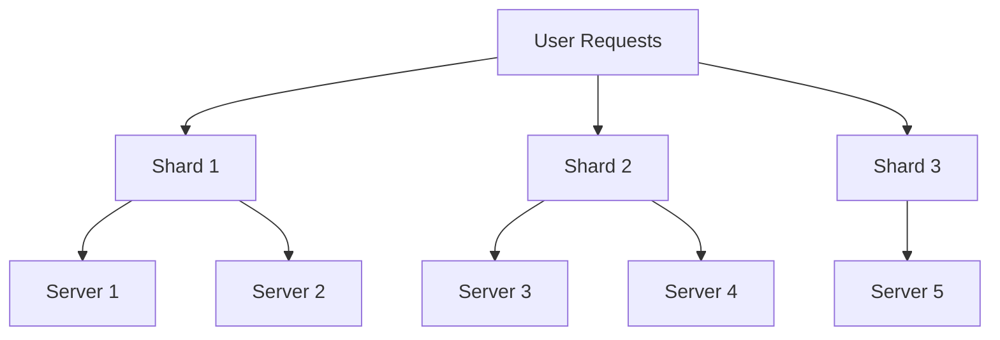

# 5. Shuffle Sharding

Imagine you have a deck of cards, and you want to distribute them among several players in a way that ensures each player gets a unique combination of cards. Shuffle sharding works similarly in distributed systems by assigning a unique subset of resources (like servers) to each user, ensuring better isolation and fault tolerance.

- A method to distribute resources among users so that each user gets a unique combination.
- Helps in isolating failures and ensuring that problems with one set of resources don't affect others.

## Why Use Shuffle Sharding?

- **Fault Isolation:** Limits the impact of a failure to a small subset of users.
- **Improved Resilience:** Reduces the likelihood of widespread outages.
- **Enhanced Performance:** Balances the load more effectively across resources.

## Implementing the Shuffle Sharding Pattern in Distributed Systems:

1. **Resource Pool Creation:** Create a pool of resources (e.g., servers, databases) that can be shared.

   ```rust
   let resources = vec!["Server1", "Server2", "Server3", "Server4", "Server5"];
   ```

2. **Sharding Mechanism:** Assign each user a unique subset of resources from the pool using a consistent hashing algorithm or another sharding method.

   ```rust
   use rand::seq::SliceRandom;
   use rand::thread_rng;

   fn get_shard_for_user(user_id: &str, resources: &[&str], shard_size: usize) -> Vec<&str> {
       let mut rng = thread_rng();
       let mut user_resources = resources.to_vec();
       user_resources.shuffle(&mut rng);
       user_resources.into_iter().take(shard_size).collect()
   }

   let user_shard = get_shard_for_user("user123", &resources, 2);
   println!("Assigned resources for user123: {:?}", user_shard);
   ```

3. **Request Handling:** When a request comes in, direct it to the assigned shard of resources.

   ```rust
   fn handle_request(user_id: &str) {
       let resources = vec!["Server1", "Server2", "Server3", "Server4", "Server5"];
       let shard = get_shard_for_user(user_id, &resources, 2);
       println!("Handling request for {} using shard {:?}", user_id, shard);
       // Process the request using the assigned shard
   }

   handle_request("user123");
   ```

## Key Points:

- **Resource Pool:** The total set of available resources.
- **Sharding:** The process of dividing resources into smaller, unique subsets.
- **Consistent Hashing:** A technique to evenly distribute resources among users.
- **Fault Isolation:** Ensuring that a failure in one shard does not affect others.



## Summary

Shuffle sharding distributes resources in a way that each user gets a unique subset, improving fault isolation and resilience in distributed systems. Implementing shuffle sharding involves creating a resource pool, using a sharding mechanism to assign resources, and handling requests based on the assigned shards. This pattern helps to ensure that failures are contained and do not affect the entire system.
