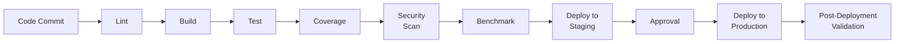

# CI/CD: Continuous Integration and Continuous Deployment

## Introduction

Imagine you're building a LEGO castle with your friends. Everyone is working on different parts of the castle at the same time. Now, what if you could have a robot that constantly checks all the pieces your friends are working on and automatically puts them together? This is what CI/CD does for software development.

CI/CD stands for Continuous Integration and Continuous Deployment. It's like having a smart robot that helps developers build, test, and deploy their code quickly and automatically.

## Continuous Integration (CI)

**Continuous Integration** is when developers frequently merge their code changes into a central repository. After merging, automated tests run to make sure the new code works well with the existing code.

### Steps in CI:

1. **Code Commit**: Developers write code and commit changes to a shared repository.
2. **Automated Build**: The code is automatically built, which means converting the code into a runnable program.
3. **Automated Tests**: Automated tests run to ensure the code works correctly.
4. **Build Artifacts**: The built code is packaged into artifacts (like executable files) for deployment.

## Continuous Deployment (CD)

**Continuous Deployment** is the next step after CI. It automates the deployment of code to production, ensuring that any code changes that pass automated tests are automatically deployed to users.

### Steps in CD:

1. **Automated Deployment**: Deploy the code to a staging environment first.
2. **Manual/Automated Approval**: Optionally, manual or automated checks can approve the deployment to production.
3. **Deploy to Production**: Deploy the code to the production environment where users can access it.
4. **Post-Deployment Validation**: Run post-deployment tests to ensure everything is working as expected.

## Setting Up CI/CD with GitLab CI/CD

### GitLab CI/CD Overview

GitLab CI/CD allows you to automate the build, test, and deployment process using a `.gitlab-ci.yml` file.

### `.gitlab-ci.yml`:

```yaml
stages:
  - lint
  - build
  - test
  - benchmark
  - security
  - deploy
  - post-deploy

variables:
  BENCHMARK_THRESHOLD: "0.05"

lint:
  stage: lint
  script:
    - rustfmt --check src/**/*.rs
    - cargo clippy -- -D warnings

build:
  stage: build
  script:
    - echo "Building the application..."
    - cargo build --release

test:
  stage: test
  script:
    - echo "Running tests..."
    - cargo test
    - cargo tarpaulin --out Xml
    - bash <(curl -s https://codecov.io/bash)

benchmark:
  stage: benchmark
  script:
    - ./run_system_benchmarks.sh
    - ./run_rust_benchmarks.sh
    - ./compare_benchmarks.sh
  allow_failure: false

security:
  stage: security
  script:
    - cargo audit
    - snyk test --file=Cargo.toml

deploy:
  stage: deploy
  script:
    - echo "Deploying to production..."
  only:
    - master

post-deploy:
  stage: post-deploy
  script:
    - ./run_smoke_tests.sh
    - ./monitor_deployment.sh
```

## Setting Up CI/CD with GitHub Actions

### GitHub Actions Overview

GitHub Actions is a powerful automation tool integrated with GitHub. It allows you to automate workflows directly from your GitHub repository.

### `workflow.yml`:

```yaml
name: CI/CD Pipeline

on:
  push:
    branches:
      - main

jobs:
  lint:
    runs-on: ubuntu-latest

    steps:
      - uses: actions/checkout@v2
      - name: Set up Rust
        uses: actions-rs/toolchain@v1
        with:
          toolchain: stable
          override: true
      - name: Run rustfmt
        run: rustfmt --check src/**/*.rs
      - name: Run Clippy
        run: cargo clippy -- -D warnings

  build:
    runs-on: ubuntu-latest

    steps:
      - uses: actions/checkout@v2
      - name: Set up Rust
        uses: actions-rs/toolchain@v1
        with:
          toolchain: stable
          override: true
      - name: Build
        run: cargo build --release

  test:
    runs-on: ubuntu-latest

    steps:
      - uses: actions/checkout@v2
      - name: Set up Rust
        uses: actions-rs/toolchain@v1
        with:
          toolchain: stable
          override: true
      - name: Run tests
        run: cargo test

  coverage:
    runs-on: ubuntu-latest

    steps:
      - uses: actions/checkout@v2
      - name: Set up Rust
        uses: actions-rs/toolchain@v1
        with:
          toolchain: stable
          override: true
      - name: Run tarpaulin
        run: cargo tarpaulin --out Xml
      - name: Upload coverage to Codecov
        run: bash <(curl -s https://codecov.io/bash)

  security:
    runs-on: ubuntu-latest

    steps:
      - uses: actions/checkout@v2
      - name: Set up Rust
        uses: actions-rs/toolchain@v1
        with:
          toolchain: stable
          override: true
      - name: Run cargo audit
        run: cargo audit
      - name: Run Snyk
        uses: snyk/actions/github@master
        with:
          args: test --file=Cargo.toml

  deploy:
    runs-on: ubuntu-latest
    needs: [lint, build, test, coverage, security]

    steps:
      - name: Deploy to production
        run: echo "Deploying to production..."
```

## Other CI/CD Tools

1. **Jenkins**: An open-source automation server that enables developers to build, test, and deploy their software.
2. **Travis CI**: A continuous integration service used to build and test software projects hosted on GitHub.
3. **CircleCI**: A CI/CD tool that allows automation across the user's pipeline from code building, testing to deployment.
4. **Azure DevOps**: Provides development collaboration tools including Azure Pipelines for CI/CD.

## Steps to Set Up a Good CI/CD Routine

1. **Define the Pipeline**: Create a clear CI/CD pipeline that includes stages like build, test, and deploy.
2. **Automate Tests**: Write automated tests to verify your code works as expected.
3. **Use Version Control**: Use a version control system (like Git) to manage your code.
4. **Continuous Integration**: Ensure that every code change triggers a build and test process.
5. **Continuous Deployment**: Automate the deployment process to ensure quick and reliable delivery.
6. **Linting**: Use linting tools such as `rustfmt` and `cargo clippy` to ensure code quality and consistency.
7. **Security Scanning**: Integrate security scanning tools like `cargo-audit` and `Snyk` to check for vulnerabilities.
8. **Dependency Updates**: Regularly update dependencies using tools like `dependabot`.
9. **Test Coverage Analysis**: Measure code coverage using tools like `kcov` or `tarpaulin`.
10. **Performance Regression Testing**: Compare performance metrics against historical data to detect regressions.
11. **Artifact Storage**: Store build artifacts for later analysis or rollback purposes.
12. **Canary Deployments**: Deploy to a small subset of users first and gradually roll out.
13. **Post-Deployment Validation**: Run smoke tests or automated end-to-end tests after deployment.
14. **Monitoring and Alerts**: Use tools like `Prometheus` and `Grafana` to monitor and set up alerts.
15. **Rollback Mechanism**: Implement a rollback strategy for quick reversion in case of issues.
16. **Documentation**: Ensure CI/CD pipeline and related processes are well-documented.
17. **Compliance Checks**: Automate compliance checks to meet regulatory requirements.

## Example CI/CD Pipeline Diagram



## Summary

CI/CD is like having a smart robot to help developers continuously integrate and deploy their code. It makes the software development process faster, more reliable, and easier to manage. By automating builds, tests, and deployments, developers can focus on writing code and delivering new features quickly and efficiently. Whether using GitLab CI/CD, GitHub Actions, or other tools, setting up a solid CI/CD routine ensures high-quality software delivery.
