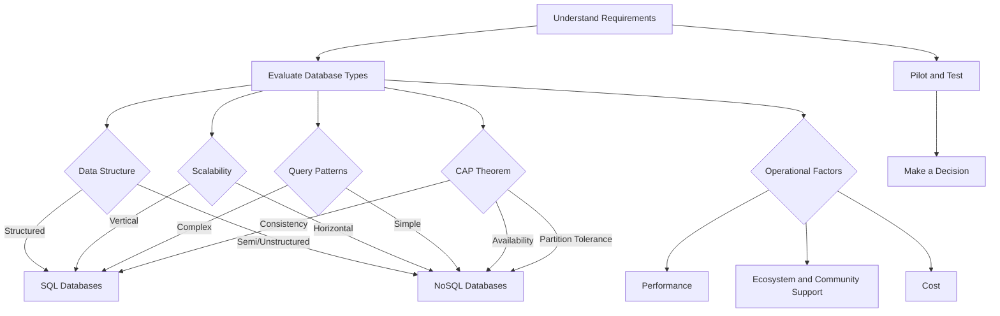

# Decision Process for Choosing a Database

## 1. Understand Your Requirements

### Data Structure

- **Structured Data**: Data that fits neatly into tables with rows and columns (e.g., relational databases like MySQL, PostgreSQL).
- **Semi-Structured Data**: Data with some organizational properties but not rigid schema (e.g., JSON, XML - MongoDB, CouchDB).
- **Unstructured Data**: Data without a predefined data model (e.g., multimedia files, logs - NoSQL databases like Cassandra).

### Scalability

- **Vertical Scaling**: Adding more power (CPU, RAM) to existing machines (e.g., traditional SQL databases).
- **Horizontal Scaling**: Adding more machines to handle data (e.g., NoSQL databases).

### Query Patterns

- **Complex Queries and Transactions**: SQL databases are better for complex joins and ACID transactions.
- **Simple Reads and Writes**: NoSQL databases can handle high read/write operations efficiently.

### Consistency, Availability, and Partition Tolerance (CAP Theorem)

- **Consistency**: Every read receives the most recent write.
- **Availability**: Every request receives a response (without guarantee of the most recent write).
- **Partition Tolerance**: The system continues to function despite network partitions.

## 2. Evaluate Database Types

### SQL Databases

- **Examples**: MySQL, PostgreSQL, Oracle, SQL Server.
- **Best For**: Structured data, complex queries, transactions.
- **Scalability**: Primarily vertical, though horizontal scaling is possible with techniques like sharding and read replicas.

### NoSQL Databases

- **Types**: Document (MongoDB), Key-Value (Redis), Column-Family (Cassandra), Graph (Neo4j).
- **Best For**: Unstructured/semi-structured data, high scalability, and availability.
- **Scalability**: Horizontal by design.

## 3. Consider Operational Factors

### Performance

- **Read/Write Operations**: Choose a database that handles your specific read/write load efficiently.
- **Latency and Throughput**: Evaluate based on your application's tolerance for latency and required throughput.

### Ecosystem and Community Support

- **Community Support**: Strong community can help with troubleshooting and best practices.
- **Ecosystem**: Availability of tools for backup, monitoring, and management.

### Cost

- **Initial and Operational Costs**: Consider licensing costs, cloud service fees, and operational expenses.

## 4. Pilot and Test

- **Prototype**: Implement a prototype to test how well the database fits your requirements.
- **Benchmarking**: Perform load testing and evaluate performance metrics.

## 5. Make a Decision

Based on the collected data and tests, choose the database that best meets your requirements.

## Real-World Examples

### Example 1: E-Commerce Platform

#### Requirements:

- Structured data for products, customers, and orders.
- Complex transactions and queries (e.g., order processing, inventory management).
- Scalability to handle traffic spikes during sales.

#### Solution:

- **Database**: PostgreSQL
- **Reason**: Supports complex transactions, robust ACID compliance, and can handle structured data efficiently. Horizontal scaling via sharding and read replicas.

### Example 2: Social Media Application

#### Requirements:

- High volume of unstructured/semi-structured data (e.g., user posts, comments, likes).
- Need for horizontal scalability to handle millions of users.
- Prioritize availability and partition tolerance.

#### Solution:

- **Database**: Cassandra
- **Reason**: Designed for high availability and partition tolerance, suitable for unstructured data and horizontal scalability.

## Mermaid Diagram

### Conclusion

Choosing the right database involves understanding your specific requirements, evaluating different database types, considering operational factors, and performing thorough testing. The right choice depends on a combination of your application's data structure, scalability needs, query patterns, consistency requirements, performance, ecosystem, and cost considerations. By following this structured approach, you can make an informed decision that aligns with your project's goals and constraints.
