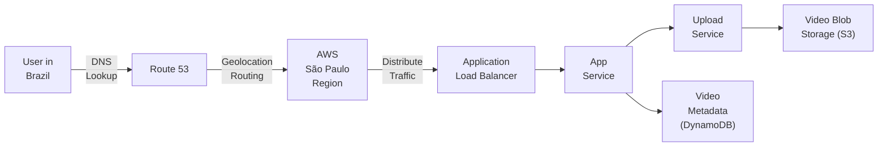
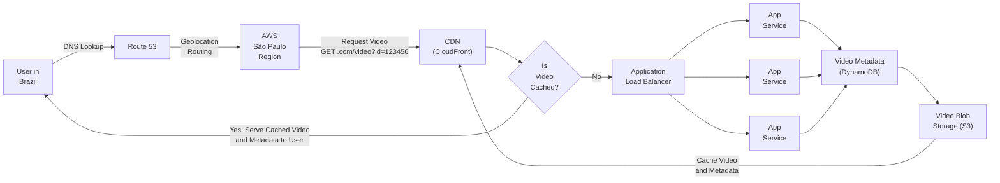

## TikTok Design System

```mermaid
graph LR
    A[User in \n Brazil] -->|DNS \n Lookup| B[Route 53]
    B -->|Geolocation \n Routing| C[AWS \n São Paulo \n Region]
    C -->|Distribute \n Traffic| D[Application \n Load Balancer]
    D --> E[App \n Service]
    E --> F[Upload \n Service]
    F --> G["Video Blob \n Storage (S3)"]
    E --> H["Video \n Metadata \n (DynamoDB)"]
```

---

```mermaid
graph LR
    %% User Request
    A[User in \n Brazil] -->|DNS Lookup| B[Route 53]
    B -->|Geolocation \n Routing| C[AWS \n São Paulo \n Region]

    %% CDN Request
    C -->|Request Video \n GET <domain>.com/video?id=123456| D["CDN \n (CloudFront)"]
    D --> E{Is \n Video \n Cached?}
    E -->|Yes: Serve Cached Video \n and Metadata to User| A

    %% Load Balancer and App Service
    E -->|No| G[Application \n Load Balancer]
    G --> H[App \n Service]
    G --> Y[App \n Service]
    G --> Z[App \n Service]
    H --> I["Video Metadata \n (DynamoDB)"]
    Y --> I
    Z --> I

    %% Fetch and Serve Video
    I --> M["Video Blob \n Storage (S3)"]
    M -->|Cache Video \n and Metadata| D

```

## TikTok Design System
