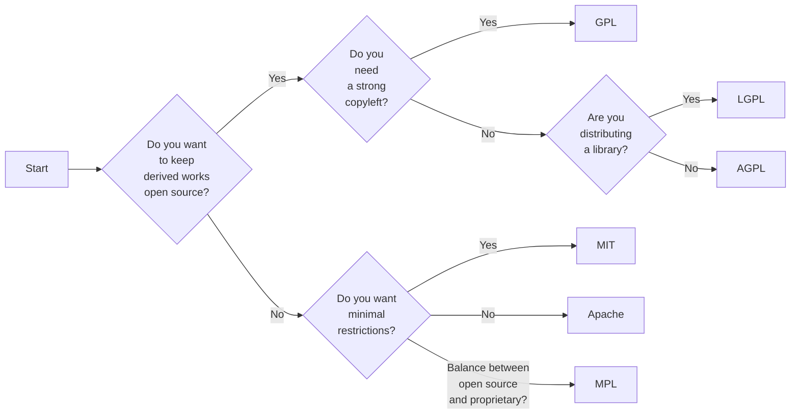

# Overview of Open Source Licenses

Open source licenses are legal agreements that allow software to be freely used, modified, and shared. They dictate how the software can be used, distributed, and modified. Here’s a comprehensive guide to understanding the types of open source licenses, their key characteristics, and real-world examples.

## Types of Open Source Licenses

1. **Permissive Licenses**
2. **Copyleft Licenses**
3. **Other Notable Licenses**

## 1. Permissive Licenses

Permissive licenses are open source licenses that impose minimal restrictions on how the software can be used, modified, and redistributed. They are often preferred for their flexibility.

### Common Permissive Licenses

**Apache License 2.0**

- **Key Characteristics**:
  - Allows users to use, modify, and distribute the software.
  - Requires preservation of copyright notices and disclaimers.
  - Provides an express grant of patent rights from contributors to users.
- **Example**: Apache HTTP Server, Kubernetes

**MIT License**

- **Key Characteristics**:
  - Very short and simple.
  - Allows users to do almost anything with the software, including using it in proprietary software.
  - Requires preservation of copyright notice.
- **Example**: jQuery, Rails

**BSD License**

- **Key Characteristics**:
  - Similar to the MIT License but has variants like the 2-clause and 3-clause BSD licenses.
  - Allows redistribution and use with minimal restrictions.
- **Example**: FreeBSD, OpenBSD

## 2. Copyleft Licenses

Copyleft licenses are open source licenses that require any modified versions of the software to also be open source and distributed under the same license. This ensures that the software remains free and open.

### Common Copyleft Licenses

**GNU General Public License (GPL)**

- **Key Characteristics**:
  - Strong copyleft license.
  - Requires that any derivative work be distributed under the same license.
  - Ensures that the source code is available to end-users.
- **Example**: Linux kernel, WordPress

**GNU Lesser General Public License (LGPL)**

- **Key Characteristics**:
  - Less restrictive than the GPL.
  - Allows linking with non-(L)GPL licensed software.
  - Suitable for libraries.
- **Example**: GNU C Library (glibc)

**Affero General Public License (AGPL)**

- **Key Characteristics**:
  - Similar to GPL but includes an additional clause.
  - Requires that the source code be available to users who interact with the software over a network.
- **Example**: MongoDB, Rocket.Chat

## 3. Other Notable Licenses

**Mozilla Public License (MPL) 2.0**

- **Key Characteristics**:
  - Hybrid license with elements of both permissive and copyleft licenses.
  - Allows mixing of MPL-licensed code with proprietary code under certain conditions.
  - Ensures that changes to MPL-licensed code remain under MPL.
- **Example**: Mozilla Firefox, Thunderbird

**Eclipse Public License (EPL)**

- **Key Characteristics**:
  - Weak copyleft license.
  - Allows linking with non-EPL licensed software.
  - Ensures that the source code is available for EPL-licensed components.
- **Example**: Eclipse IDE, Jenkins

## Real-World Examples and Use Cases

**1. Apache License 2.0**

- **Example**: Apache HTTP Server
- **Use Case**: Suitable for projects that require contributions from a diverse set of developers, providing a clear grant of patent rights.

**2. MIT License**

- **Example**: jQuery
- **Use Case**: Ideal for small libraries and tools where maximum adoption is desired with minimal legal restrictions.

**3. GPL**

- **Example**: Linux Kernel
- **Use Case**: Projects that aim to ensure freedom to use, modify, and distribute the software, keeping it open source.

**4. MPL**

- **Example**: Mozilla Firefox
- **Use Case**: Projects that need to balance open source with the ability to integrate with proprietary code.

## License Decision Process

To aid in understanding when to choose each type of license, here’s a mermaid diagram illustrating a decision process:

## Conclusion

Choosing the right open source license depends on your project’s goals and how you want your software to be used, modified, and distributed. Understanding the characteristics of each license type helps in making an informed decision that aligns with your project's objectives.

## Summary Table of Common Licenses

| License    | Type       | Key Characteristics                                                 | Example Projects             |
| ---------- | ---------- | ------------------------------------------------------------------- | ---------------------------- |
| Apache 2.0 | Permissive | Grant of patent rights, minimal restrictions                        | Apache HTTP Server, Kafka    |
| MIT        | Permissive | Very permissive, minimal restrictions                               | jQuery, Rails                |
| BSD        | Permissive | Similar to MIT, minimal restrictions                                | FreeBSD, OpenBSD             |
| GPL        | Copyleft   | Strong copyleft, keeps derived works open source                    | Linux Kernel, WordPress      |
| LGPL       | Copyleft   | Lesser copyleft, suitable for libraries                             | GNU C Library (glibc)        |
| AGPL       | Copyleft   | Network use clause, suitable for server-side software               | MongoDB, Rocket.Chat         |
| MPL        | Hybrid     | Balance between permissive and copyleft, allows proprietary linking | Mozilla Firefox, Thunderbird |
| EPL        | Copyleft   | Weak copyleft, suitable for software development tools              | Eclipse IDE, Jenkins         |

This comprehensive guide should help you understand the various open source licenses, their characteristics, and how to choose the right one for your project.
