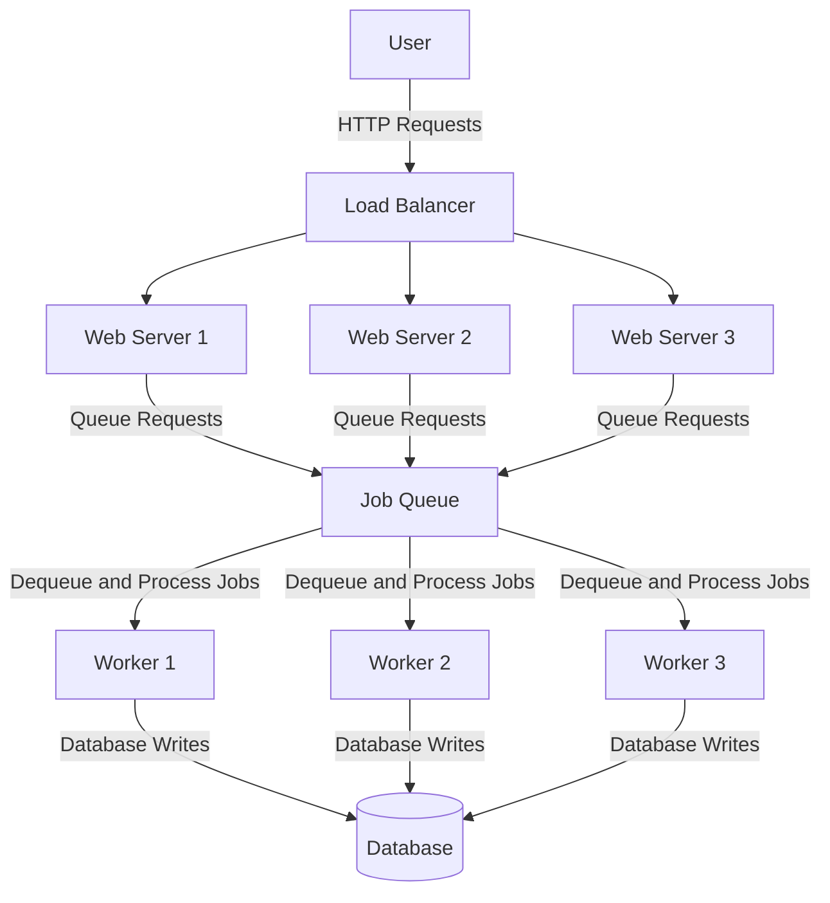

# Handling High Traffic for Ticket Sales

## Introduction

For handling a high-traffic event like selling tickets for a popular DJ, you should use a combination of both load balancing and a queue-based system. Here's how each component can help and how they can work together:

## 1. Load Balancing

**Load Balancing** helps distribute incoming traffic across multiple servers to ensure no single server is overwhelmed. This can improve the system's capacity to handle a large number of simultaneous requests.

### Benefits:
- **Scalability**: Distributes load evenly across multiple servers.
- **Redundancy**: Ensures that if one server fails, others can continue to handle requests.
- **Performance**: Improves response times by balancing the load.

### Implementation:
- **Add More Servers**: Spin up additional servers to handle the increased load.
- **Configure Load Balancer**: Use a load balancer (e.g., AWS Elastic Load Balancing, Nginx, HAProxy) to distribute traffic among servers.

## 2. Queue-Based System

**Queue-Based System** (using workers and jobs) can help manage high bursts of traffic by queuing requests and processing them asynchronously.

### Benefits:
- **Throttling**: Controls the rate at which requests are processed, preventing system overload.
- **Asynchronous Processing**: Allows immediate acknowledgment of user requests while processing them in the background.
- **Retry Mechanism**: Can implement retries for failed jobs without user intervention.

### Implementation:
- **Job Queue**: Use a job queue (e.g., RabbitMQ, AWS SQS, Redis Queue) to queue incoming ticket purchase requests.
- **Workers**: Implement worker processes that dequeue and process ticket purchase requests.

## Combining Both Approaches

Combining load balancing with a queue-based system provides a robust solution to handle high traffic and ensure smooth processing of ticket sales.

### Steps to Implement the Combined Solution:

1. **Set Up Load Balancer**:
   - Configure a load balancer to distribute incoming traffic across multiple web servers.
   - Ensure web servers are auto-scaled to handle varying loads.

2. **Implement Job Queue**:
   - Integrate a job queue to handle ticket purchase requests.
   - Queue incoming requests and acknowledge them immediately to users.
   - Dequeue requests and process them asynchronously.

3. **Develop Worker Processes**:
   - Implement worker processes that poll the job queue, process ticket purchases, and update the database.
   - Ensure workers are scaled based on the queue length to handle high demand.

4. **Optimize Database**:
   - Ensure the database can handle high read/write operations, possibly using sharding, replication, or a high-performance database system.

5. **Monitor and Scale**:
   - Continuously monitor system performance and scale both web servers and worker processes as needed.
   - Implement monitoring tools (e.g., Prometheus, Grafana) to track metrics and alerts.

## Example Architecture Diagram

## Summary

- **Load Balancing**: Distributes traffic across multiple servers, enhancing scalability and performance.
- **Queue-Based System**: Manages high traffic by queuing requests and processing them asynchronously.
- **Combined Approach**: Provides a robust, scalable solution for handling high-demand events by leveraging both load balancing and job queues.
- **Implementation**: Set up load balancer, integrate job queue, develop worker processes, optimize the database, and monitor the system.

By using both strategies, you can ensure that your system remains responsive and reliable even under extreme traffic conditions.
