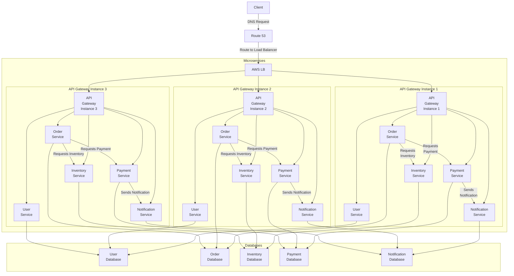

# Microservices: An In-Depth Guide

## Introduction

Microservices architecture is a design pattern for developing applications as a collection of loosely coupled, independently deployable services. Each service is small, focused on a specific business capability, and can be developed, deployed, and scaled independently.

## Key Concepts

### 1. **Service-Oriented Architecture (SOA)**

Microservices is a refinement of the broader Service-Oriented Architecture (SOA) approach. While SOA encompasses a range of principles and patterns for designing and developing services, microservices focus specifically on the modularization of applications into independent services.

### 2. **Single Responsibility Principle**

Each microservice is designed to perform a specific business function or capability. This adherence to the Single Responsibility Principle ensures that services remain small and manageable.

### 3. **Decentralized Data Management**

In a microservices architecture, each service typically manages its own database. This decentralized data management approach contrasts with monolithic architectures where a single database is shared by all application components.

### 4. **Inter-Service Communication**

Microservices communicate with each other using lightweight protocols, typically HTTP/HTTPS with REST APIs or messaging queues. This ensures that services remain loosely coupled.

### 5. **Independently Deployable**

One of the core advantages of microservices is that each service can be deployed independently. This allows for more agile development and continuous deployment practices.

## Benefits of Microservices

### 1. **Scalability**

Microservices can be scaled independently, allowing specific parts of an application to handle increased load without scaling the entire application.

### 2. **Flexibility**

Different services can be developed using different programming languages and technologies, providing flexibility to use the best tools for each job.

### 3. **Resilience**

Failures in one service do not necessarily bring down the entire system. Each service can be designed to handle its own failures gracefully.

### 4. **Faster Development**

Teams can develop and deploy services independently, speeding up the development process and enabling continuous delivery and integration.

### 5. **Improved Maintainability**

Smaller, focused services are easier to understand, test, and maintain compared to a large monolithic application.

## Challenges of Microservices

### 1. **Complexity**

Managing multiple services introduces complexity, including handling inter-service communication, data consistency, and distributed transactions.

### 2. **Deployment Overhead**

Deploying many services independently can increase the operational overhead, requiring sophisticated deployment and orchestration tools.

### 3. **Data Management**

Ensuring data consistency and managing transactions across multiple services can be challenging.

### 4. **Inter-Service Communication**

Reliable inter-service communication and handling network-related issues require robust design and implementation.

## Implementing Microservices

### Step-by-Step Guide

1. **Decompose the Monolith**

   - Identify business capabilities and decompose the monolithic application into smaller, independent services.

2. **Define Service Boundaries**

   - Clearly define the boundaries and responsibilities of each microservice to avoid overlaps and dependencies.

3. **Choose the Communication Protocol**

   - Select appropriate communication protocols (e.g., REST, gRPC, messaging queues) based on the use case and performance requirements.

4. **Design for Resilience**

   - Implement patterns like circuit breakers, retries, and timeouts to handle failures gracefully.

5. **Deploy Independently**

   - Use containerization technologies like Docker to package services, and orchestration tools like Kubernetes to manage deployments.

6. **Monitor and Manage**

   - Implement monitoring, logging, and tracing to manage and troubleshoot services effectively.

## Example Architecture

### Service Decomposition

1. **User Service**: Handles user authentication, authorization, and profile management.
2. **Order Service**: Manages order creation, processing, and tracking.
3. **Inventory Service**: Keeps track of product inventory, availability, and stock levels.
4. **Payment Service**: Processes payments and manages transaction records.
5. **Notification Service**: Sends email, SMS, and push notifications to users.

### Inter-Service Communication

- **REST API**: Used for synchronous communication between services.
- **Message Broker**: (e.g., RabbitMQ, Kafka) Used for asynchronous communication and event-driven architecture.

### Visual Representation



**Explanation**:

1.  **Client** sends a DNS request to **Route 53**.
2.  **Route 53** directs the request to the **AWS Load Balancer** (Elastic Load Balancer).
3.  **AWS Load Balancer** distributes incoming traffic to multiple instances of the **API Gateway**.
4.  Each **API Gateway Instance** routes requests to the appropriate microservice:
    - **User Service**
    - **Order Service**
    - **Inventory Service**
    - **Payment Service**
    - **Notification Service**
5.  The **Order Service** interacts with:
    - **Inventory Service** to check inventory.
    - **Payment Service** to process payments.
6.  The **Payment Service** sends notifications via the **Notification Service**.
7.  Each microservice interacts with its own dedicated database for data management. The databases are:
    - **User Database**
    - **Order Database**
    - **Inventory Database**
    - **Payment Database**
    - **Notification Database**

**AWS Services**:

- **Route 53**: Amazon's scalable DNS and domain name service.
- **AWS Load Balancer**: Amazon's Elastic Load Balancer (ELB) which distributes incoming application traffic across multiple targets, such as EC2 instances, containers, and IP addresses.

This setup ensures that the application is scalable, highly available, and resilient to failures.

### Example Code

#### User Service (Python Flask)

```python
from flask import Flask, request, jsonify

app = Flask(__name__)

users = {}

@app.route('/user', methods=['POST'])
def create_user():
    user = request.json
    users[user['id']] = user
    return jsonify(user), 201

@app.route('/user/<user_id>', methods=['GET'])
def get_user(user_id):
    user = users.get(user_id)
    if user:
        return jsonify(user)
    return jsonify({'error': 'User not found'}), 404

if __name__ == '__main__':
    app.run(port=5000)
```

#### Order Service (Node.js)

```javascript
const express = require("express");
const app = express();
app.use(express.json());

let orders = {};

app.post("/order", (req, res) => {
  const order = req.body;
  orders[order.id] = order;
  res.status(201).json(order);
});

app.get("/order/:orderId", (req, res) => {
  const order = orders[req.params.orderId];
  if (order) {
    res.json(order);
  } else {
    res.status(404).json({ error: "Order not found" });
  }
});

app.listen(5001, () => {
  console.log("Order service listening on port 5001");
});
```

## Monitoring and Management

### Tools and Techniques

- **Logging**: Centralized logging using tools like ELK Stack (Elasticsearch, Logstash, Kibana) or Grafana Loki.
- **Monitoring**: Use Prometheus and Grafana for real-time monitoring and alerting.
- **Distributed Tracing**: Implement distributed tracing with Jaeger or Zipkin to trace requests across multiple services.
- **Service Mesh**: Use a service mesh like Istio to manage microservice communication, security, and observability.

### Example Monitoring Setup

#### Prometheus Configuration

```yaml
global:
  scrape_interval: 15s

scrape_configs:
  - job_name: "user-service"
    static_configs:
      - targets: ["localhost:5000"]

  - job_name: "order-service"
    static_configs:
      - targets: ["localhost:5001"]
```

#### Grafana Dashboard

- Create dashboards in Grafana to visualize metrics collected by Prometheus.
- Set up alerts to notify when specific thresholds are breached (e.g., high error rates, latency).

## Best Practices

### 1. **API Gateway**

Use an API Gateway to manage and route requests to appropriate microservices, handle authentication, rate limiting, and logging.

### 2. **Data Consistency**

Implement eventual consistency where immediate consistency is not feasible. Use techniques like sagas or distributed transactions to ensure data integrity.

### 3. **Security**

Secure each service by implementing authentication and authorization. Use OAuth2, JWTs, and API keys as needed.

### 4. **CI/CD Pipelines**

Set up continuous integration and continuous deployment (CI/CD) pipelines to automate the build, test, and deployment process.

### 5. **Documentation**

Maintain thorough documentation for each service, including APIs, data models, and interaction diagrams.

## Conclusion

Microservices architecture offers a scalable, flexible, and resilient approach to building modern applications. While it introduces complexity, the benefits in terms of scalability, resilience, and maintainability often outweigh the challenges. By following best practices and leveraging the right tools, organizations can effectively implement and manage microservices to achieve their business goals.

### Summary

- **Microservices**: A design pattern for developing applications as a collection of loosely coupled, independently deployable services.
- **Benefits**: Scalability, flexibility, resilience, faster development, improved maintainability.
- **Challenges**: Complexity, deployment overhead, data management, inter-service communication.
- **Implementation**: Decompose the monolith, define service boundaries, choose communication protocols, design for resilience, deploy independently, monitor and manage.
- **Best Practices**: Use an API gateway, ensure data consistency, implement security, set up CI/CD pipelines, maintain documentation.

By adopting a microservices architecture, organizations can build robust and scalable applications capable of meeting the demands of modern users.
