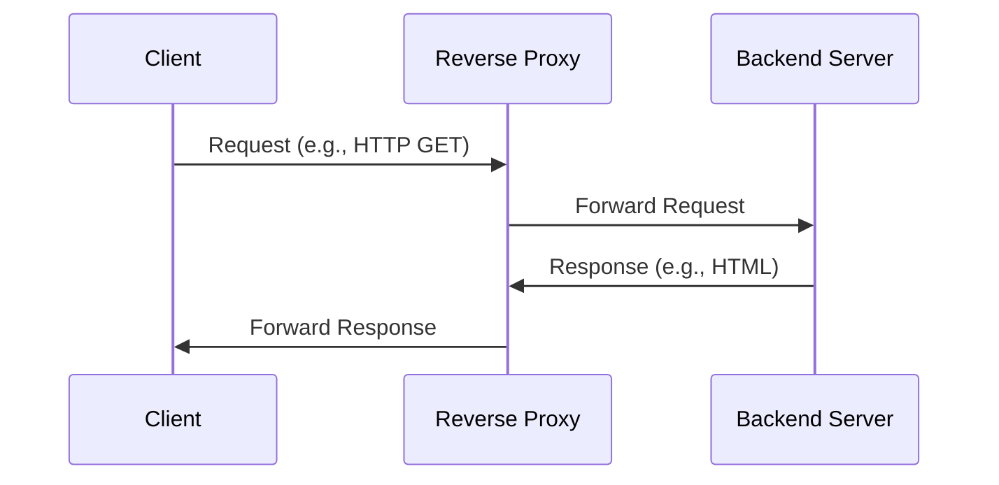
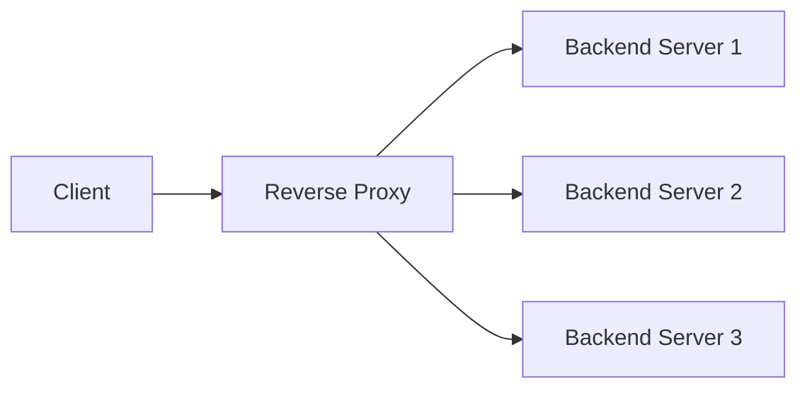
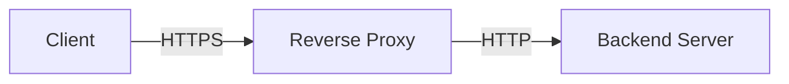
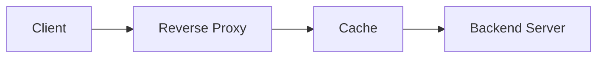
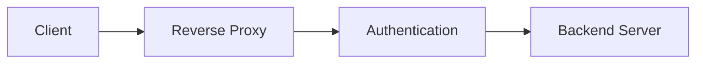
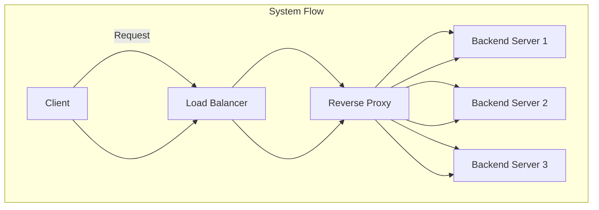

# Reverse Proxy: An In-Depth Guide

## Introduction

A reverse proxy is a server that sits between client devices and a backend server, forwarding client requests to the appropriate server and returning the server's responses to the clients. It is called a "reverse" proxy because it acts on behalf of the server, in contrast to a forward proxy, which acts on behalf of the client.

## Key Functions of a Reverse Proxy

1. **Load Balancing**
   - Distributes incoming traffic across multiple backend servers to ensure no single server becomes a bottleneck.
2. **SSL Termination**
   - Offloads the SSL/TLS encryption and decryption tasks from the backend servers, improving their performance.
3. **Caching**
   - Stores copies of frequently accessed content to reduce the load on backend servers and improve response times.
4. **Compression**
   - Compresses responses to reduce the amount of data transferred, improving load times for clients.
5. **Security**
   - Protects backend servers from direct exposure to the internet, adding an extra layer of security.
6. **Authentication and Authorization**
   - Handles user authentication and authorization before forwarding requests to backend servers.
7. **Web Acceleration**
   - Optimizes the delivery of web content, improving the performance of web applications.

## How Reverse Proxy Works



### Explanation

1. **Client**: Sends a request to the reverse proxy server.
2. **Reverse Proxy**: Forwards the request to the appropriate backend server.
3. **Backend Server**: Processes the request and sends the response back to the reverse proxy.
4. **Reverse Proxy**: Forwards the response to the client.

## Benefits of Using a Reverse Proxy

1. **Improved Load Balancing**
   - By distributing traffic across multiple servers, reverse proxies help balance the load and prevent any single server from being overwhelmed.
2. **Enhanced Security**
   - Reverse proxies hide the IP addresses of backend servers, making them less vulnerable to attacks.
3. **SSL Termination**
   - By handling SSL/TLS encryption and decryption, reverse proxies free up backend server resources.
4. **Caching and Compression**
   - Reverse proxies can cache content and compress responses, reducing load times and bandwidth usage.
5. **Centralized Authentication**
   - Simplifies the management of authentication and authorization by centralizing these tasks.

## Common Reverse Proxy Servers

### 1. **Nginx**

Nginx is a high-performance web server that can also function as a reverse proxy, load balancer, and HTTP cache.

#### Example Configuration

```nginx
server {
    listen 80;
    server_name example.com;

    location / {
        proxy_pass http://backend;
        proxy_set_header Host $host;
        proxy_set_header X-Real-IP $remote_addr;
        proxy_set_header X-Forwarded-For $proxy_add_x_forwarded_for;
        proxy_set_header X-Forwarded-Proto $scheme;
    }
}
```

### 2. **Apache HTTP Server**

Apache is a widely-used web server that can also act as a reverse proxy.

#### Example Configuration

```apache
<VirtualHost *:80>
    ServerName example.com

    ProxyPreserveHost On
    ProxyPass / http://backend/
    ProxyPassReverse / http://backend/

    <Proxy *>
        Require all granted
    </Proxy>
</VirtualHost>
```

### 3. **HAProxy**

HAProxy is a reliable, high-performance TCP/HTTP load balancer and proxy server.

#### Example Configuration

```haproxy
frontend http_front
    bind *:80
    default_backend http_back

backend http_back
    balance roundrobin
    server server1 backend1.example.com:80 check
    server server2 backend2.example.com:80 check
```

## Use Cases

### 1. **Load Balancing**

Distributing incoming traffic across multiple backend servers to ensure no single server becomes a bottleneck.



### 2. **SSL Termination**

Handling SSL/TLS encryption and decryption to offload this task from backend servers.



### 3. **Caching**

Storing copies of frequently accessed content to reduce the load on backend servers and improve response times.



### 4. **Security**

Adding an extra layer of security by hiding the IP addresses of backend servers and handling authentication and authorization.





## Conclusion

A reverse proxy is a versatile tool that offers numerous benefits, including load balancing, enhanced security, SSL termination, caching, and more. By sitting between clients and backend servers, reverse proxies can improve the performance, scalability, and security of web applications.

### Summary

- **Reverse Proxy**: A server that forwards client requests to backend servers and returns the responses to clients.
- **Key Functions**: Load balancing, SSL termination, caching, compression, security, authentication, and web acceleration.
- **Benefits**: Improved load balancing, enhanced security, SSL termination, caching, centralized authentication.
- **Common Servers**: Nginx, Apache HTTP Server, HAProxy.
- **Use Cases**: Load balancing, SSL termination, caching, security.

By understanding and implementing reverse proxies, organizations can enhance the performance, security, and scalability of their web applications, ensuring a better experience for users.
